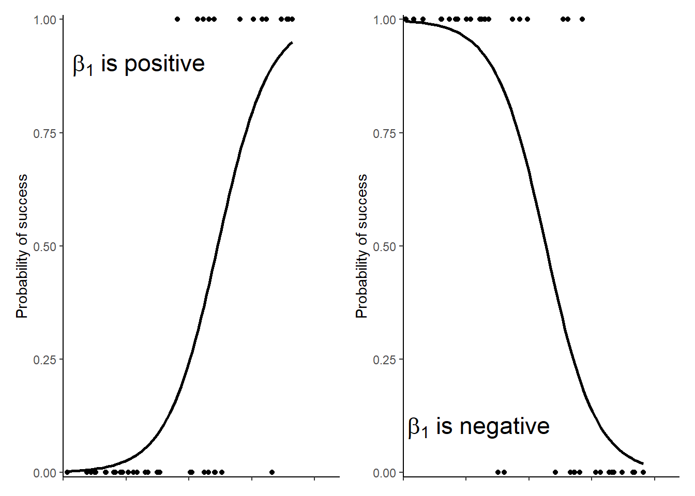

# (PART) BINOMIAL GLMs {-}

# Binomial GLM overview {#bino-glm-overview}

When a response variable can take only one of two values such as 0 and 1, dead and alive, no and yes or failure and success it follows a binomial distribution and can be modelled with a binomial GLM.  A binomial GLM is also known as logistic regression. 
Although the observations themselves can have only one of two values, the scale of the response is a probability representing the probability of 1, alive, yes or success. The link function used in a binomial GLM is the "logit" function also known as "log-odds". This means the model estimates are also log-odds. This can make it tricky to interpret the estimates but two things can help us. First, the principle about the sign of $\beta_{1}$ still applies: positive $\beta_{1}$ indicates an increase in the response with an increase in $X1$ and negative $\beta_{1}$ indicates a decrease in the response with an increase in $X1$. Second, we can use the `predict()` function to get values on the scale of the response, a probability, rather than the log-odds

When you have a single explanatory variable, that model is:

\begin{equation}
ln\left(\frac{E(y_{i})}{1-E(y_{i})}\right)=\beta_{0}+\beta_{1}X1_{i}
(\#eq:glmbino)
\end{equation}

This means that the model estimates are odds logged to the base $e$ and and the inverse function, `exp()` must be applied to them to interpret as odds. 

\begin{equation}
\frac{E(y_{i})}{1-E(y_{i})}=exp(\beta_{0}+\beta_{1}X1_{i})
(\#eq:glmbino2)
\end{equation}

or

\begin{equation}
\frac{E(y_{i})}{1-E(y_{i})}=exp(\beta_{0}) \times exp(\beta_{1})^{X1_{i}}
(\#eq:glmbino3)
\end{equation}

This looks complicated. Using the predict function because important in reporting the results.

Just like Poisson GLM with a single explanatory variable, there are two parameters in this model, $\beta_{0}$ and $\beta_{0}$ and their meaning is similar. Let us assume our response is failure or success. Then $\beta_{0}$ is the log odds of success when the explanatory variable is 0 and $\beta_{0}$ is the change in the log odds of success for each unit change in the explanatory.

<!-- of the expected $y$ when $x$ is zero - the intercept. The log of $\beta_{1}$ is not the amount you *add* to $y$ for each unit change in $x$ but the amount by which multiply. This means the model is a curve. If $\beta_{1}$ is positive, $exp(\beta_{1})$ is greater than one and $y$ increases as $x$ increases; If $\beta_{1}$ is negative, $exp(\beta_{1})$ is less than one and $y$ decreases as $x$ increases. See Figure \@ref(fig:glm-bino-poss) for an illustration of the curve for positive and negative $\beta_{1}$. -->

What exactly are odds? An odds is the probability of one outcome divided by the probability of not that outcome. For example, for a fair coin where heads and tails are equally likely, the odds of a head in a coin toss is 1 because:

$\frac{P(H)}{P( not\:head)} = \frac{0.5}{ 1- 0.5} = 1$

If you had an unfair coin where the probability of a head was $\frac{3}{4}$ then the odds of a head are:

$\frac{P(H)}{P( not\:head)} = \frac{0.75}{ 1- 0.75} = 3$

A head is three times as likely as a tail. If instead probability of a head was $\frac{1}{4}$ then the odds of a head are:

$\frac{P(H)}{P( not\:head)} = \frac{0.25}{ 1- 0.25} = 0.33333$

A head is a third as likely as a tail.

(ref:glm-bino-poss) Data fitted with a binomial GLM.

(\#fig:glm-bino-poss)(ref:glm-bino-poss)

See Figure \@ref(fig:glm-bino-annotated) for a graphical representation of generalised linear model terms. 

(ref:glm-bino-annotated) A Generalised linear model with binomial distributed errors. The measured response values are in pink, the predictions are in green, and the differences between these, known as the residuals, are in blue. The estimated model parameters, $\beta_{0}$ and $\beta_{1}$ must be exponentiated to be interpreted on the scale of the response. When $x=0$ we predict the number of $y$ to be $exp(\beta_{0})$. For each unit of $x$, the number of y changes by a factor of $exp(\beta_{1})$

For the binomial families the response can be specified in one of three ways:

As a factor: ‘success’ is interpreted as the factor not having the first level (and hence usually of having the second level).

As a numerical vector with values between 0 and 1, interpreted as the proportion of successful cases (with the total number of cases given by the weights).

As a two-column integer matrix: the first column gives the number of successes and the second the number of failures.
