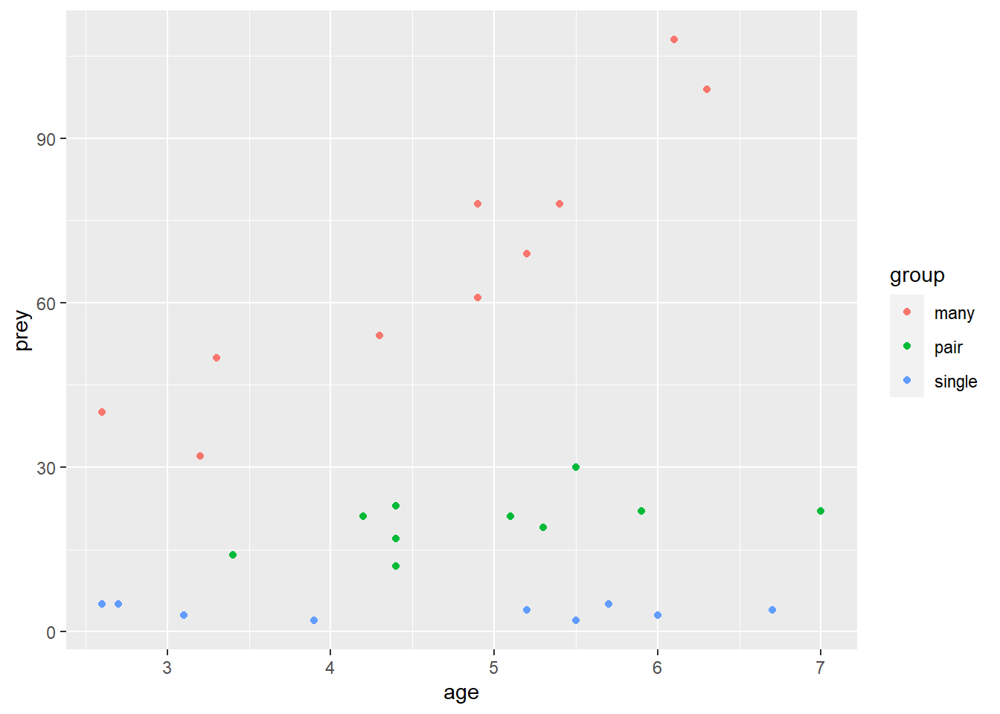
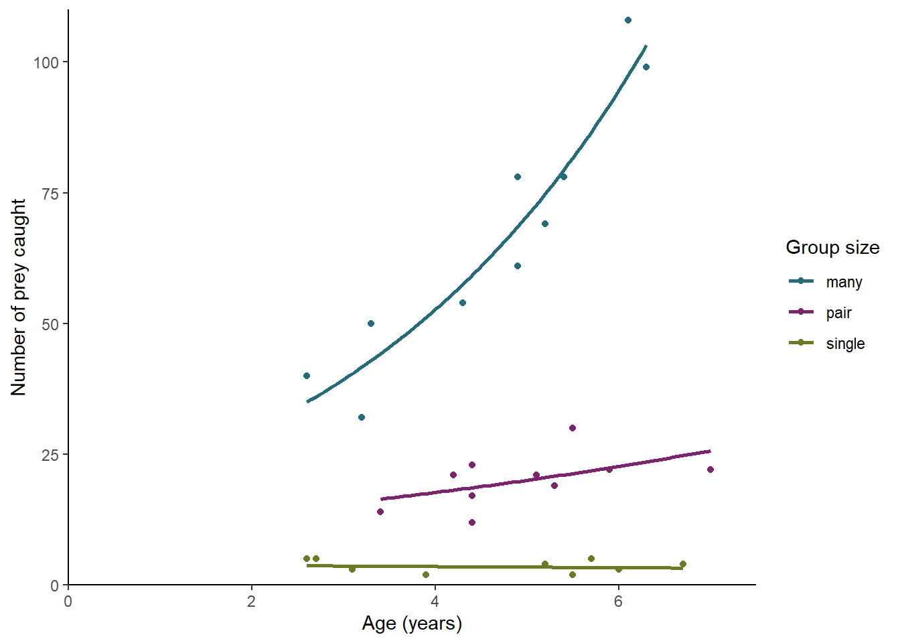
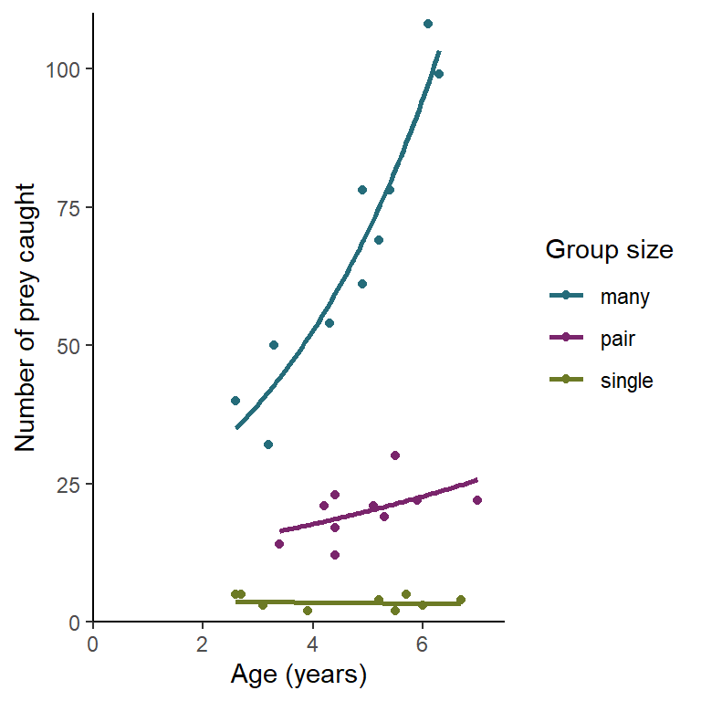

# Two explanatory variables {#pois-glm-two-cont}

## Introduction to the example

he number of insect prey individuals of a particular bird species manages to collect varies. In an effort to understand this variation, researchers recorded the number of prey an individual caught, its age (in years) and how it spent the majority of it’s time (as a single individual, in a pair or in a group of many). The data are in [birds.txt](data-raw/birds.txt). 


<div style="border: 1px solid #ddd; padding: 0px; overflow-y: scroll; height:300px; "><table class="table" style="margin-left: auto; margin-right: auto;">
 <thead>
  <tr>
   <th style="text-align:right;position: sticky; top:0; background-color: #FFFFFF;"> prey </th>
   <th style="text-align:right;position: sticky; top:0; background-color: #FFFFFF;"> age </th>
   <th style="text-align:left;position: sticky; top:0; background-color: #FFFFFF;"> group </th>
  </tr>
 </thead>
<tbody>
  <tr>
   <td style="text-align:right;"> 5 </td>
   <td style="text-align:right;"> 2.6 </td>
   <td style="text-align:left;"> single </td>
  </tr>
  <tr>
   <td style="text-align:right;"> 5 </td>
   <td style="text-align:right;"> 5.7 </td>
   <td style="text-align:left;"> single </td>
  </tr>
  <tr>
   <td style="text-align:right;"> 5 </td>
   <td style="text-align:right;"> 2.7 </td>
   <td style="text-align:left;"> single </td>
  </tr>
  <tr>
   <td style="text-align:right;"> 3 </td>
   <td style="text-align:right;"> 3.1 </td>
   <td style="text-align:left;"> single </td>
  </tr>
  <tr>
   <td style="text-align:right;"> 2 </td>
   <td style="text-align:right;"> 3.9 </td>
   <td style="text-align:left;"> single </td>
  </tr>
  <tr>
   <td style="text-align:right;"> 3 </td>
   <td style="text-align:right;"> 6.0 </td>
   <td style="text-align:left;"> single </td>
  </tr>
  <tr>
   <td style="text-align:right;"> 4 </td>
   <td style="text-align:right;"> 5.2 </td>
   <td style="text-align:left;"> single </td>
  </tr>
  <tr>
   <td style="text-align:right;"> 2 </td>
   <td style="text-align:right;"> 3.9 </td>
   <td style="text-align:left;"> single </td>
  </tr>
  <tr>
   <td style="text-align:right;"> 4 </td>
   <td style="text-align:right;"> 6.7 </td>
   <td style="text-align:left;"> single </td>
  </tr>
  <tr>
   <td style="text-align:right;"> 2 </td>
   <td style="text-align:right;"> 5.5 </td>
   <td style="text-align:left;"> single </td>
  </tr>
  <tr>
   <td style="text-align:right;"> 22 </td>
   <td style="text-align:right;"> 7.0 </td>
   <td style="text-align:left;"> pair </td>
  </tr>
  <tr>
   <td style="text-align:right;"> 12 </td>
   <td style="text-align:right;"> 4.4 </td>
   <td style="text-align:left;"> pair </td>
  </tr>
  <tr>
   <td style="text-align:right;"> 19 </td>
   <td style="text-align:right;"> 5.3 </td>
   <td style="text-align:left;"> pair </td>
  </tr>
  <tr>
   <td style="text-align:right;"> 23 </td>
   <td style="text-align:right;"> 4.4 </td>
   <td style="text-align:left;"> pair </td>
  </tr>
  <tr>
   <td style="text-align:right;"> 17 </td>
   <td style="text-align:right;"> 4.4 </td>
   <td style="text-align:left;"> pair </td>
  </tr>
  <tr>
   <td style="text-align:right;"> 14 </td>
   <td style="text-align:right;"> 3.4 </td>
   <td style="text-align:left;"> pair </td>
  </tr>
  <tr>
   <td style="text-align:right;"> 22 </td>
   <td style="text-align:right;"> 5.9 </td>
   <td style="text-align:left;"> pair </td>
  </tr>
  <tr>
   <td style="text-align:right;"> 21 </td>
   <td style="text-align:right;"> 5.1 </td>
   <td style="text-align:left;"> pair </td>
  </tr>
  <tr>
   <td style="text-align:right;"> 21 </td>
   <td style="text-align:right;"> 4.2 </td>
   <td style="text-align:left;"> pair </td>
  </tr>
  <tr>
   <td style="text-align:right;"> 30 </td>
   <td style="text-align:right;"> 5.5 </td>
   <td style="text-align:left;"> pair </td>
  </tr>
  <tr>
   <td style="text-align:right;"> 54 </td>
   <td style="text-align:right;"> 4.3 </td>
   <td style="text-align:left;"> many </td>
  </tr>
  <tr>
   <td style="text-align:right;"> 78 </td>
   <td style="text-align:right;"> 5.4 </td>
   <td style="text-align:left;"> many </td>
  </tr>
  <tr>
   <td style="text-align:right;"> 69 </td>
   <td style="text-align:right;"> 5.2 </td>
   <td style="text-align:left;"> many </td>
  </tr>
  <tr>
   <td style="text-align:right;"> 78 </td>
   <td style="text-align:right;"> 4.9 </td>
   <td style="text-align:left;"> many </td>
  </tr>
  <tr>
   <td style="text-align:right;"> 50 </td>
   <td style="text-align:right;"> 3.3 </td>
   <td style="text-align:left;"> many </td>
  </tr>
  <tr>
   <td style="text-align:right;"> 61 </td>
   <td style="text-align:right;"> 4.9 </td>
   <td style="text-align:left;"> many </td>
  </tr>
  <tr>
   <td style="text-align:right;"> 99 </td>
   <td style="text-align:right;"> 6.3 </td>
   <td style="text-align:left;"> many </td>
  </tr>
  <tr>
   <td style="text-align:right;"> 108 </td>
   <td style="text-align:right;"> 6.1 </td>
   <td style="text-align:left;"> many </td>
  </tr>
  <tr>
   <td style="text-align:right;"> 40 </td>
   <td style="text-align:right;"> 2.6 </td>
   <td style="text-align:left;"> many </td>
  </tr>
  <tr>
   <td style="text-align:right;"> 32 </td>
   <td style="text-align:right;"> 3.2 </td>
   <td style="text-align:left;"> many </td>
  </tr>
</tbody>
</table></div>


:::key
There are 3 variables: the response, `prey`, is the number of caught by an individual; `age`, gives the individual's agein years (to one tenth of a year); and `group` indicates how the individuals spent the majority of its time.
:::


We will import the data with the `read_table2()` function and plot it with `ggplot()`.


```r
birds <- read_table2("data-raw/birds.txt")
```

We need to be able to show the different group behaviours


```r
# a default scatter plot of the data
ggplot(data = birds, aes(x = age, y = prey, colour = group)) +
  geom_point()
```


Individuals that spend most of their time with many individuals catch more prey and this effect is increased with age. Individuals that spend most of their time alone do not seem to improve with age.


## Applying and interpreting `glm()`

We build a generalised linear model of the number of cases explained by the distance with the `glm()` function as follows:


```r
mod <- glm(data = birds, prey ~ group * age, family = poisson)
```
Printing `mod` to the console gives us the estimated model parameters:

```r
mod
# 
# Call:  glm(formula = prey ~ group * age, family = poisson, data = birds)
# 
# Coefficients:
#     (Intercept)        grouppair      groupsingle              age  
#           2.794           -0.416           -1.406            0.293  
#   grouppair:age  groupsingle:age  
#          -0.168           -0.323  
# 
# Degrees of Freedom: 29 Total (i.e. Null);  24 Residual
# Null Deviance:	    849 
# Residual Deviance: 21 	AIC: 172
```


$\beta_{0}$ is labelled "(Intercept)" and $\beta_{1}$ to $\beta_{5}$ are labelled "grouppair", "groupsingle", "age", "grouppair:age" and "groupsingle:age" Thus the equation of the line is:

<center> $ln(prey)$ = 2.794 $+$ -0.416$\times grouppair$ $+$ -1.406$\times groupsingle$ $+$ 0.293$\times age$ $+$ -0.168$\times grouppair:age$ $+$ -0.323$\times groupsingle:age$ </center>

The intercept is the log of the expected number of prey items caught by 0 aged birds that spend the majority of their time in a group of many. The fact that the estimate for grouppair (-0.416) is negative tells us that as such those in pairs catch fewer. Single birds also catch fewer. The positive coefficient for age indicates that more prey are caught with age.

These estimates are on the scale of the link function, that is, they are logged (to the base e, natural logs) in this case.

To understand the parameters the on the scale of the response we apply the inverse of the $ln$ function, the `exp()` function


```r
exp(mod$coefficients)
#     (Intercept)       grouppair     groupsingle             age   grouppair:age 
#          16.338           0.660           0.245           1.340           0.845 
# groupsingle:age 
#           0.724
```

These estimates are on the scale of the link function, that is, they are logged (to the base e, natural logs) in this case.

To understand the parameters the on the scale of the response we apply the inverse of the $ln$ function, the `exp()` function


```r
exp(mod$coefficients)
#     (Intercept)       grouppair     groupsingle             age   grouppair:age 
#          16.338           0.660           0.245           1.340           0.845 
# groupsingle:age 
#           0.724
```

So:

$prey$ = 16.338 $\times$ 0.66$^{grouppair}$ $\times$ 0.245$^{groupsingle}$ $\times$ 0.66$^{grouppair}$ $\times$ 0.845$^{grouppair:age}$ $\times$ 0.724$^{groupsingle:age}$

More information including statistical tests of the model and its parameters is obtained by using `summary()`:


```r
summary(mod) 
# 
# Call:
# glm(formula = prey ~ group * age, family = poisson, data = birds)
# 
# Deviance Residuals: 
#    Min      1Q  Median      3Q     Max  
# -1.640  -0.667  -0.172   0.650   1.767  
# 
# Coefficients:
#                 Estimate Std. Error z value Pr(>|z|)    
# (Intercept)       2.7935     0.1813   15.41   <2e-16 ***
# grouppair        -0.4161     0.4078   -1.02    0.308    
# groupsingle      -1.4059     0.5949   -2.36    0.018 *  
# age               0.2927     0.0354    8.27   <2e-16 ***
# grouppair:age    -0.1685     0.0789   -2.13    0.033 *  
# groupsingle:age  -0.3226     0.1260   -2.56    0.010 *  
# ---
# Signif. codes:  0 '***' 0.001 '**' 0.01 '*' 0.05 '.' 0.1 ' ' 1
# 
# (Dispersion parameter for poisson family taken to be 1)
# 
#     Null deviance: 848.806  on 29  degrees of freedom
# Residual deviance:  21.048  on 24  degrees of freedom
# AIC: 171.8
# 
# Number of Fisher Scoring iterations: 4
```

The `Coefficients` table gives the estimated $\beta s$ again but this time with their standard errors and tests of whether the estimates differ from zero. For example, The estimated value for the intercept is 2.794 $\pm$ 0.181 and this differs significantly from zero ($p$ < 0.001). The estimated value for $\beta_{1}$ is -0.416 $\pm$ 0.408 does not differ significantly from zero ($p$ = 0.308). At age 0, birds in pairs do not catch significantly fewer prey. 

Towards the bottom of the output there is information about the model fit. The null deviance (what exists if we predict the number of prey from the mean of birds in groups of many, $\beta_{0}$) is 848.806 with 29 degrees of freedom and the residual deviance (left over after our model is fitted) is 21.048 with 24 $d.f.$. The model fits a five parameters and thus accounts for 5 $d.f.$ for a reduction in deviance by 827.758.

To get a test of whether the reduction in deviance is significant for each term in the the model formula we use:


```r
anova(mod, test = "Chisq") 
# Analysis of Deviance Table
# 
# Model: poisson, link: log
# 
# Response: prey
# 
# Terms added sequentially (first to last)
# 
# 
#           Df Deviance Resid. Df Resid. Dev Pr(>Chi)    
# NULL                         29        849             
# group      2      752        27         97  < 2e-16 ***
# age        1       66        26         31  4.1e-16 ***
# group:age  2       10        24         21   0.0071 ** 
# ---
# Signif. codes:  0 '***' 0.001 '**' 0.01 '*' 0.05 '.' 0.1 ' ' 1
```

All three terms in the model significantly reduce the deviance: group ($p=$< 0.001), age ($p=$< 0.001) and the interaction between them ($p=$= 0.007). The effect of age is not the same for individuals in groups of different sizes.

## Getting predictions from the model
The `predict()` function returns the predicted values of the response. To add a column of predicted values to the dataframe: we need to specify they should be on the scale of the responses, not on the scale of the link function.

```r
birds$pred <- predict(mod, type = "response")
```

This gives predictions for the ages used. If you want predictions for other ages you need to create a data frame of the values from which you want to predict

To predict for ages 0, 1 and 7 for each group size we can use:


```r
predict_for <- data.frame(group = rep(c("many", "pair", "single"), each = 3),
                      age = rep(c(c(0, 1, 7)), times = 3))
```

We then specify this dataframe in the `predict()` function using the `newdata` argument          

```r

# then predicting
predict_for$pred <- predict(mod, newdata = predict_for, type = "response")
```

## Creating a figure


```r
ggplot(data = birds, aes(x = age, y = prey, colour = group)) +
  geom_point() +
  geom_smooth(method = "glm",
              method.args = list(family = "poisson"),
              se = FALSE) +
  scale_color_manual(values = pal4, name = "Group size") +
  scale_x_continuous(expand = c(0, 0),
                     limits = c(0, 7.5),
                     name = "Age (years)") +
  scale_y_continuous(expand = c(0, 0.03),
                     limits = c(0, 110),
                     name = "Number of prey caught") +
  theme_classic()
  
```




## Reporting the results.

.... . See figure \@ref(fig:fig-birds).

(ref:fig-birds-report) tum tee tum

<div class="figure" style="text-align: left">

<p class="caption">(\#fig:fig-birds-report)(ref:fig-birds-report)</p>
</div>
