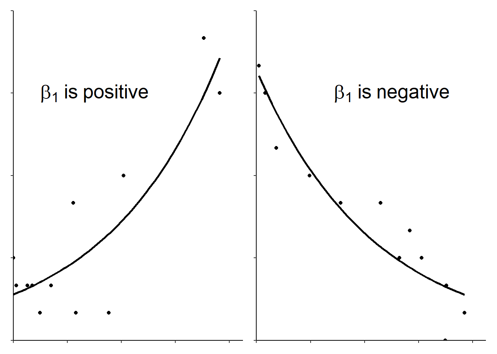
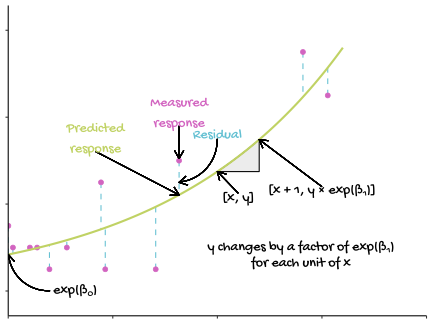

# (PART) POISSON GLMs {-}

# Poisson GLM overview {#pois-glm-overview}

When a response variable is the count of things it can often not be approximated by a normal distribution. Instead it follows a Poisson distribution. Such variables are always positive - they range from 0 to $\infty$. A Poisson GLM is also known as Poisson regression. The link function used in a Poisson GLM is the natural logarithm, $ln$.

When you have a single explanatory variable, that model is:

\begin{equation}
ln(E(y_{i}))=\beta_{0}+\beta_{1}X1_{i}
(\#eq:glmpois)
\end{equation}

This means that the model estimates are logged to the base $e$ and and the inverse function, `exp()` must be applied to them to interpret them in terms of the response. In other words, to make predictions about the expected value of the response we need to exponentiate the coefficients.

\begin{equation}
E(y_{i})=exp(\beta_{0}+\beta_{1}X1_{i})
(\#eq:glmpois2)
\end{equation}

or

\begin{equation}
E(y_{i})=exp(\beta_{0}) \times exp(\beta_{1})^{X1_{i}}
(\#eq:glmpois3)
\end{equation}

Just like examples of general linear models with a single explanatory variable, there are two parameters in this model, $\beta_{0}$ and $\beta_{0}$ and their meaning is similar. $\beta_{0}$ is the log of the expected $y$ when $x$ is zero - the intercept. The log of $\beta_{1}$ is not the amount you *add* to $y$ for each unit change in $x$ but the amount by which multiply. This means the model is a curve. If $\beta_{1}$ is positive, $exp(\beta_{1})$ is greater than one and $y$ increases as $x$ increases; If $\beta_{1}$ is negative, $exp(\beta_{1})$ is less than one and $y$ decreases as $x$ increases. See Figure \@ref(fig:glm-pois-poss) for an illustration of the curve for positive and negative $\beta_{1}$.

(ref:glm-pois-poss) Data fitted with a Poisson GLM.

(\#fig:glm-pois-poss)(ref:glm-pois-poss)

blah blah blah

See Figure \@ref(fig:glm-pois-annotated) for a graphical representation of generalised linear model terms. 

(ref:glm-pois-annotated) A Generalised linear model with Poisson distributed errors. The measured response values are in pink, the predictions are in green, and the differences between these, known as the residuals, are in blue. The estimated model parameters, $\beta_{0}$ and $\beta_{1}$ must be exponentiated to be interpreted on the scale of the response. When $x=0$ we predict the number of $y$ to be $exp(\beta_{0})$. For each unit of $x$, the number of y changes by a factor of $exp(\beta_{1})$

(\#fig:glm-pois-annotated)(ref:glm-pois-annotated)

## When explanatory is categorical

one explanatory *use chi-squared*

## More than one explanatory

