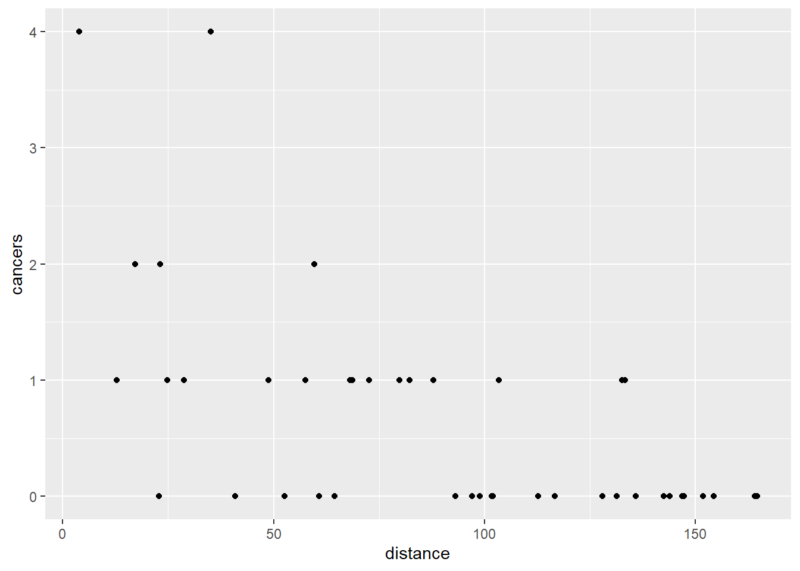

# (PART) USING `glm()` FOR POISSON RESPONSES {-}

# Single continuous predictor 

## Introduction to the example

Does proximity to a nuclear power plant alter the risk of cancer?
Number of cases of cancer reported by a clinic by its distance from nuclear plant (note not good epidemiology). each row is a clinic
[caes.txt](data-raw/cases.txt)


```r
cases <- read_table2("data-raw/cases.txt")
```


```r
ggplot(data = cases, aes(x = distance, y = cancers)) +
  geom_point()
```



## Applying and interpreting lm()


```r
mod <- glm(data = cases, cancers ~ distance, family = poisson)

```


```r
mod
# 
# Call:  glm(formula = cancers ~ distance, family = poisson, data = cases)
# 
# Coefficients:
# (Intercept)     distance  
#      1.0192      -0.0215  
# 
# Degrees of Freedom: 42 Total (i.e. Null);  41 Residual
# Null Deviance:	    54.5 
# Residual Deviance: 31.8 	AIC: 78.2
```

```r
mod$coefficients
# (Intercept)    distance 
#      1.0192     -0.0215
```


The fact that the estimate for distance (1.019) is negative tells us that as distance increases, the number of cancers reported goes down.

These estimates are on the scale of the link function, that is, they are logged (to the base e, natural logs) in this case.

To understand thm on the scale of the response we apply the inverse of the ln function, the exp() function


```r
exp(mod$coefficients)
# (Intercept)    distance 
#       2.771       0.979
```

$\beta_{0}$ is labelled "(Intercept)" and $\beta_{1}$ is labelled "distance". Thus the equation of the line is:

<center> $cancers$ = 1.019 $\times$ -0.021$^{distance}$ </center>

The model predicts there will be 2.771 cancers at a clinic at no distance from the power plant.

Recall that for a linear model with one predictor, the second estimate is the amount added to the intercept when the predictor changes by one value. Since this is glm with a log link, the value of 0.979 is amount the intercept is multiplied by. Thus the model predicts there will be 2.771 $\times$ 0.979 =  2.712 cancers 1 km away and 2.771 $\times$ 0.979 $\times$ 0.979 =  2.654 cancers 2 km away. That is: $\beta_{0}$ $\times$ $\beta_{0}^n$ mm at $n$ km away.


```r
summary(mod) 
# 
# Call:
# glm(formula = cancers ~ distance, family = poisson, data = cases)
# 
# Deviance Residuals: 
#    Min      1Q  Median      3Q     Max  
# -1.842  -0.744  -0.483   0.421   1.893  
# 
# Coefficients:
#             Estimate Std. Error z value Pr(>|z|)    
# (Intercept)  1.01917    0.30871    3.30  0.00096 ***
# distance    -0.02150    0.00503   -4.27    2e-05 ***
# ---
# Signif. codes:  0 '***' 0.001 '**' 0.01 '*' 0.05 '.' 0.1 ' ' 1
# 
# (Dispersion parameter for poisson family taken to be 1)
# 
#     Null deviance: 54.522  on 42  degrees of freedom
# Residual deviance: 31.790  on 41  degrees of freedom
# AIC: 78.16
# 
# Number of Fisher Scoring iterations: 5
```


To get a test of the model overall


```r
anova(mod, test = "Chisq") 
# Analysis of Deviance Table
# 
# Model: poisson, link: log
# 
# Response: cancers
# 
# Terms added sequentially (first to last)
# 
# 
#          Df Deviance Resid. Df Resid. Dev Pr(>Chi)    
# NULL                        42       54.5             
# distance  1     22.7        41       31.8  1.9e-06 ***
# ---
# Signif. codes:  0 '***' 0.001 '**' 0.01 '*' 0.05 '.' 0.1 ' ' 1
```

```r
pchisq(22.732, 1, lower.tail = F)
# [1] 1.86e-06
```

## Getting predictions from the model

The `predict()` function returns the predicted values of the response. To add a column of predicted values to the dataframe:
we need to specify they should be on the scale of the responses, no the link function scale.


```r
cases$pred <- predict(mod, type = "response")
```


This gives predictions for the actual x values used. If you want predicts for other values of x you need to creating a data frame of the x values from which you want to predict


```r
predictions <- data.frame(distance = seq(0, 180, 10))
```


```r
predictions$pred <- predict(mod, newdata = predictions, type = "response")
```

