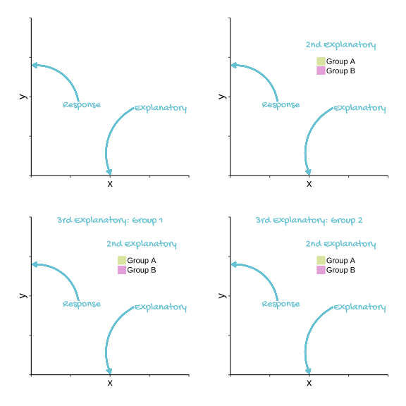
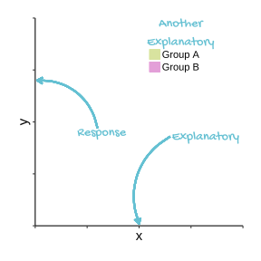

# (PART) INTRODUCTION {-}

# Revision of your Introductory class
In experimental design and execution we manipulate or choose one or more variables and record how changing their values effect another variable. The variables we manipulate or choose are called explanatory or predictor variables and the other is called the response. These are also known as independent and dependent variables respectively.

:::key
Predictor, Explanatory, *x* and Independent: all terms used to describe the variables we choose.  
:::

:::key
Predicted, Response, *y* and Dependent: all terms used to describe the variable we measure.
:::

When we plot data, the response variable goes on the *y*-axis and the explanatory variable goes on the *x*-axis

If we have two explanatory variables we might indicate the different values of one of them with colour.

In choosing between regression, *t*-tests, one-way ANOVA and two-way ANOVA we consider how many explanatory variables we have and whether they are continuous or categorical. If we have one explanatory variable and it is continuous, we can apply a regression; if it is a categorical variable with two groups (or levels) we have the choice of a *t*-test or a one way ANOVA but when there are more than two groups we use a one-way ANOVA. A two-way ANOVA is used when there are two categorical explanatory variables.

These apparently different tests are, in fact, the same test. They have the same underlying mathematics and, or to put it another way, the follow the same model. That model is usually known as the **General Linear Model**. 

Running a test = building or fitting a model. tests of how well our data fit the model, tests for the model parameters against a null hypothesis

In R *t*-tests and ANOVA, like regression, can be carried out with the `lm()` function. The output differs but the results themselves are identical. The model makes a prediction for the response variable for a given value of the explanatory variable. The difference between the predicted value and the observed value is the residual.

:::key
`lm()` can be used to perform tests using the General Linear Model including *t*-tests, ANOVA and regression for response variables which are normally distributed.
:::

The General Linear Model requires that the response variable has residuals that follow the normal distribution with variance which is homogeneous for the values of the explanatory variables. This commonly occurs when the response variable has a normal distribution. The **General_ised_** Linear Model* extends the General Linear Model by including response variables that do not follow the normal distribution. 

