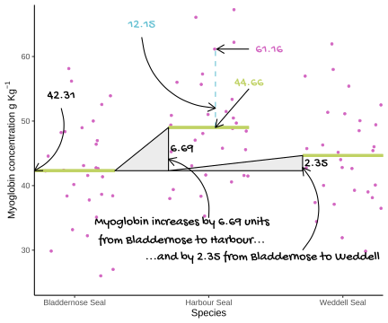

# One-way ANOVA revisited {#one-way-anova-revisit}

In this chapter we again consider an example with one categorical explanatory variable. However, this time it has more than two groups (or levels). We first use the familiar `aov()` function to carry out a one-way ANOVA and then use our understanding to help us understand the output of `lm()`. We will also make predictions from the model and report on our results.


## Introduction to the example

(ref:weddell-fig) Baby Weddell Seals are very cute. By Photo © Samuel Blanc, CC BY-SA 3.0, https://commons.wikimedia.org/w/index.php?curid=3877642

<div class="figure" style="text-align: left">

<p class="caption">(\#fig:weddell-fig)(ref:weddell-fig)</p>
</div>

The myoglobin concentration of skeletal muscle (in grams per kilogram of muscle) for three species of seal (see Figure \@ref(fig:weddell-fig)) is given  [seal.txt](data-raw/seal.text). 

<div style="border: 1px solid #ddd; padding: 0px; overflow-y: scroll; height:300px; "><table class="table" style="margin-left: auto; margin-right: auto;">
 <thead>
  <tr>
   <th style="text-align:left;position: sticky; top:0; background-color: #FFFFFF;"> species </th>
   <th style="text-align:right;position: sticky; top:0; background-color: #FFFFFF;"> myoglobin </th>
  </tr>
 </thead>
<tbody>
  <tr>
   <td style="text-align:left;"> Harbour Seal </td>
   <td style="text-align:right;"> 49.7 </td>
  </tr>
  <tr>
   <td style="text-align:left;"> Harbour Seal </td>
   <td style="text-align:right;"> 51.0 </td>
  </tr>
  <tr>
   <td style="text-align:left;"> Harbour Seal </td>
   <td style="text-align:right;"> 41.6 </td>
  </tr>
  <tr>
   <td style="text-align:left;"> Harbour Seal </td>
   <td style="text-align:right;"> 45.6 </td>
  </tr>
  <tr>
   <td style="text-align:left;"> Harbour Seal </td>
   <td style="text-align:right;"> 39.4 </td>
  </tr>
  <tr>
   <td style="text-align:left;"> Harbour Seal </td>
   <td style="text-align:right;"> 43.1 </td>
  </tr>
  <tr>
   <td style="text-align:left;"> Harbour Seal </td>
   <td style="text-align:right;"> 55.7 </td>
  </tr>
  <tr>
   <td style="text-align:left;"> Harbour Seal </td>
   <td style="text-align:right;"> 66.1 </td>
  </tr>
  <tr>
   <td style="text-align:left;"> Harbour Seal </td>
   <td style="text-align:right;"> 56.0 </td>
  </tr>
  <tr>
   <td style="text-align:left;"> Harbour Seal </td>
   <td style="text-align:right;"> 47.0 </td>
  </tr>
  <tr>
   <td style="text-align:left;"> Harbour Seal </td>
   <td style="text-align:right;"> 51.5 </td>
  </tr>
  <tr>
   <td style="text-align:left;"> Harbour Seal </td>
   <td style="text-align:right;"> 50.9 </td>
  </tr>
  <tr>
   <td style="text-align:left;"> Harbour Seal </td>
   <td style="text-align:right;"> 53.4 </td>
  </tr>
  <tr>
   <td style="text-align:left;"> Harbour Seal </td>
   <td style="text-align:right;"> 35.3 </td>
  </tr>
  <tr>
   <td style="text-align:left;"> Harbour Seal </td>
   <td style="text-align:right;"> 45.2 </td>
  </tr>
  <tr>
   <td style="text-align:left;"> Harbour Seal </td>
   <td style="text-align:right;"> 38.4 </td>
  </tr>
  <tr>
   <td style="text-align:left;"> Harbour Seal </td>
   <td style="text-align:right;"> 50.5 </td>
  </tr>
  <tr>
   <td style="text-align:left;"> Harbour Seal </td>
   <td style="text-align:right;"> 49.4 </td>
  </tr>
  <tr>
   <td style="text-align:left;"> Harbour Seal </td>
   <td style="text-align:right;"> 41.6 </td>
  </tr>
  <tr>
   <td style="text-align:left;"> Harbour Seal </td>
   <td style="text-align:right;"> 41.5 </td>
  </tr>
  <tr>
   <td style="text-align:left;"> Harbour Seal </td>
   <td style="text-align:right;"> 45.8 </td>
  </tr>
  <tr>
   <td style="text-align:left;"> Harbour Seal </td>
   <td style="text-align:right;"> 48.1 </td>
  </tr>
  <tr>
   <td style="text-align:left;"> Harbour Seal </td>
   <td style="text-align:right;"> 57.3 </td>
  </tr>
  <tr>
   <td style="text-align:left;"> Harbour Seal </td>
   <td style="text-align:right;"> 61.2 </td>
  </tr>
  <tr>
   <td style="text-align:left;"> Harbour Seal </td>
   <td style="text-align:right;"> 48.8 </td>
  </tr>
  <tr>
   <td style="text-align:left;"> Harbour Seal </td>
   <td style="text-align:right;"> 62.2 </td>
  </tr>
  <tr>
   <td style="text-align:left;"> Harbour Seal </td>
   <td style="text-align:right;"> 38.0 </td>
  </tr>
  <tr>
   <td style="text-align:left;"> Harbour Seal </td>
   <td style="text-align:right;"> 40.6 </td>
  </tr>
  <tr>
   <td style="text-align:left;"> Harbour Seal </td>
   <td style="text-align:right;"> 67.3 </td>
  </tr>
  <tr>
   <td style="text-align:left;"> Harbour Seal </td>
   <td style="text-align:right;"> 48.5 </td>
  </tr>
  <tr>
   <td style="text-align:left;"> Weddell Seal </td>
   <td style="text-align:right;"> 55.4 </td>
  </tr>
  <tr>
   <td style="text-align:left;"> Weddell Seal </td>
   <td style="text-align:right;"> 40.1 </td>
  </tr>
  <tr>
   <td style="text-align:left;"> Weddell Seal </td>
   <td style="text-align:right;"> 46.3 </td>
  </tr>
  <tr>
   <td style="text-align:left;"> Weddell Seal </td>
   <td style="text-align:right;"> 29.8 </td>
  </tr>
  <tr>
   <td style="text-align:left;"> Weddell Seal </td>
   <td style="text-align:right;"> 52.5 </td>
  </tr>
  <tr>
   <td style="text-align:left;"> Weddell Seal </td>
   <td style="text-align:right;"> 37.4 </td>
  </tr>
  <tr>
   <td style="text-align:left;"> Weddell Seal </td>
   <td style="text-align:right;"> 42.8 </td>
  </tr>
  <tr>
   <td style="text-align:left;"> Weddell Seal </td>
   <td style="text-align:right;"> 51.4 </td>
  </tr>
  <tr>
   <td style="text-align:left;"> Weddell Seal </td>
   <td style="text-align:right;"> 48.5 </td>
  </tr>
  <tr>
   <td style="text-align:left;"> Weddell Seal </td>
   <td style="text-align:right;"> 44.0 </td>
  </tr>
  <tr>
   <td style="text-align:left;"> Weddell Seal </td>
   <td style="text-align:right;"> 58.0 </td>
  </tr>
  <tr>
   <td style="text-align:left;"> Weddell Seal </td>
   <td style="text-align:right;"> 45.4 </td>
  </tr>
  <tr>
   <td style="text-align:left;"> Weddell Seal </td>
   <td style="text-align:right;"> 37.1 </td>
  </tr>
  <tr>
   <td style="text-align:left;"> Weddell Seal </td>
   <td style="text-align:right;"> 39.3 </td>
  </tr>
  <tr>
   <td style="text-align:left;"> Weddell Seal </td>
   <td style="text-align:right;"> 45.1 </td>
  </tr>
  <tr>
   <td style="text-align:left;"> Weddell Seal </td>
   <td style="text-align:right;"> 51.1 </td>
  </tr>
  <tr>
   <td style="text-align:left;"> Weddell Seal </td>
   <td style="text-align:right;"> 38.1 </td>
  </tr>
  <tr>
   <td style="text-align:left;"> Weddell Seal </td>
   <td style="text-align:right;"> 36.5 </td>
  </tr>
  <tr>
   <td style="text-align:left;"> Weddell Seal </td>
   <td style="text-align:right;"> 49.4 </td>
  </tr>
  <tr>
   <td style="text-align:left;"> Weddell Seal </td>
   <td style="text-align:right;"> 62.0 </td>
  </tr>
  <tr>
   <td style="text-align:left;"> Weddell Seal </td>
   <td style="text-align:right;"> 45.7 </td>
  </tr>
  <tr>
   <td style="text-align:left;"> Weddell Seal </td>
   <td style="text-align:right;"> 57.0 </td>
  </tr>
  <tr>
   <td style="text-align:left;"> Weddell Seal </td>
   <td style="text-align:right;"> 42.6 </td>
  </tr>
  <tr>
   <td style="text-align:left;"> Weddell Seal </td>
   <td style="text-align:right;"> 40.0 </td>
  </tr>
  <tr>
   <td style="text-align:left;"> Weddell Seal </td>
   <td style="text-align:right;"> 31.9 </td>
  </tr>
  <tr>
   <td style="text-align:left;"> Weddell Seal </td>
   <td style="text-align:right;"> 42.7 </td>
  </tr>
  <tr>
   <td style="text-align:left;"> Weddell Seal </td>
   <td style="text-align:right;"> 46.0 </td>
  </tr>
  <tr>
   <td style="text-align:left;"> Weddell Seal </td>
   <td style="text-align:right;"> 39.0 </td>
  </tr>
  <tr>
   <td style="text-align:left;"> Weddell Seal </td>
   <td style="text-align:right;"> 50.1 </td>
  </tr>
  <tr>
   <td style="text-align:left;"> Weddell Seal </td>
   <td style="text-align:right;"> 34.4 </td>
  </tr>
  <tr>
   <td style="text-align:left;"> Bladdernose Seal </td>
   <td style="text-align:right;"> 56.2 </td>
  </tr>
  <tr>
   <td style="text-align:left;"> Bladdernose Seal </td>
   <td style="text-align:right;"> 48.4 </td>
  </tr>
  <tr>
   <td style="text-align:left;"> Bladdernose Seal </td>
   <td style="text-align:right;"> 37.8 </td>
  </tr>
  <tr>
   <td style="text-align:left;"> Bladdernose Seal </td>
   <td style="text-align:right;"> 42.8 </td>
  </tr>
  <tr>
   <td style="text-align:left;"> Bladdernose Seal </td>
   <td style="text-align:right;"> 27.0 </td>
  </tr>
  <tr>
   <td style="text-align:left;"> Bladdernose Seal </td>
   <td style="text-align:right;"> 43.1 </td>
  </tr>
  <tr>
   <td style="text-align:left;"> Bladdernose Seal </td>
   <td style="text-align:right;"> 42.4 </td>
  </tr>
  <tr>
   <td style="text-align:left;"> Bladdernose Seal </td>
   <td style="text-align:right;"> 29.9 </td>
  </tr>
  <tr>
   <td style="text-align:left;"> Bladdernose Seal </td>
   <td style="text-align:right;"> 42.3 </td>
  </tr>
  <tr>
   <td style="text-align:left;"> Bladdernose Seal </td>
   <td style="text-align:right;"> 58.1 </td>
  </tr>
  <tr>
   <td style="text-align:left;"> Bladdernose Seal </td>
   <td style="text-align:right;"> 32.2 </td>
  </tr>
  <tr>
   <td style="text-align:left;"> Bladdernose Seal </td>
   <td style="text-align:right;"> 38.4 </td>
  </tr>
  <tr>
   <td style="text-align:left;"> Bladdernose Seal </td>
   <td style="text-align:right;"> 52.6 </td>
  </tr>
  <tr>
   <td style="text-align:left;"> Bladdernose Seal </td>
   <td style="text-align:right;"> 53.9 </td>
  </tr>
  <tr>
   <td style="text-align:left;"> Bladdernose Seal </td>
   <td style="text-align:right;"> 42.3 </td>
  </tr>
  <tr>
   <td style="text-align:left;"> Bladdernose Seal </td>
   <td style="text-align:right;"> 46.4 </td>
  </tr>
  <tr>
   <td style="text-align:left;"> Bladdernose Seal </td>
   <td style="text-align:right;"> 44.6 </td>
  </tr>
  <tr>
   <td style="text-align:left;"> Bladdernose Seal </td>
   <td style="text-align:right;"> 49.0 </td>
  </tr>
  <tr>
   <td style="text-align:left;"> Bladdernose Seal </td>
   <td style="text-align:right;"> 40.2 </td>
  </tr>
  <tr>
   <td style="text-align:left;"> Bladdernose Seal </td>
   <td style="text-align:right;"> 41.4 </td>
  </tr>
  <tr>
   <td style="text-align:left;"> Bladdernose Seal </td>
   <td style="text-align:right;"> 38.6 </td>
  </tr>
  <tr>
   <td style="text-align:left;"> Bladdernose Seal </td>
   <td style="text-align:right;"> 35.1 </td>
  </tr>
  <tr>
   <td style="text-align:left;"> Bladdernose Seal </td>
   <td style="text-align:right;"> 48.2 </td>
  </tr>
  <tr>
   <td style="text-align:left;"> Bladdernose Seal </td>
   <td style="text-align:right;"> 33.2 </td>
  </tr>
  <tr>
   <td style="text-align:left;"> Bladdernose Seal </td>
   <td style="text-align:right;"> 38.4 </td>
  </tr>
  <tr>
   <td style="text-align:left;"> Bladdernose Seal </td>
   <td style="text-align:right;"> 26.0 </td>
  </tr>
  <tr>
   <td style="text-align:left;"> Bladdernose Seal </td>
   <td style="text-align:right;"> 50.0 </td>
  </tr>
  <tr>
   <td style="text-align:left;"> Bladdernose Seal </td>
   <td style="text-align:right;"> 42.6 </td>
  </tr>
  <tr>
   <td style="text-align:left;"> Bladdernose Seal </td>
   <td style="text-align:right;"> 47.0 </td>
  </tr>
  <tr>
   <td style="text-align:left;"> Bladdernose Seal </td>
   <td style="text-align:right;"> 41.6 </td>
  </tr>
</tbody>
</table></div>

The data were collected to determine whether muscle myoglobin differed between species.


:::key
There are 2 variables. 
`seal` is the explanatory variable; it is categorical with 3 levels, `Bladdernose Seal`, `Harbour Seal` and `Weddell Seal`.
`myoglobin`, a continuous variable, is the response.
:::

We can use the `read_delim()` function to import the data and visualise it with `ggplot()`.


```r
seal <- read_delim("data-raw/seal.txt", delim = " ")
```


```r
# create a rough plot of the data  
ggplot(data = seal, aes(x = species, y = myoglobin)) +
  geom_violin()
```


Harbour Seals seem to have higher myoglobin than the other two species and the variance in myoglobin for the three species looks about the same.

Let's create a summary of the data that will be useful for plotting later:

```r
seal_summary <- seal %>%
  group_by(species) %>%
  summarise(mean = mean(myoglobin),
            std = sd(myoglobin),
            n = length(myoglobin),
            se = std/sqrt(n))
```

<table>
 <thead>
  <tr>
   <th style="text-align:left;"> species </th>
   <th style="text-align:right;"> mean </th>
   <th style="text-align:right;"> std </th>
   <th style="text-align:right;"> n </th>
   <th style="text-align:right;"> se </th>
  </tr>
 </thead>
<tbody>
  <tr>
   <td style="text-align:left;"> Bladdernose Seal </td>
   <td style="text-align:right;"> 42.3 </td>
   <td style="text-align:right;"> 8.02 </td>
   <td style="text-align:right;"> 30 </td>
   <td style="text-align:right;"> 1.46 </td>
  </tr>
  <tr>
   <td style="text-align:left;"> Harbour Seal </td>
   <td style="text-align:right;"> 49.0 </td>
   <td style="text-align:right;"> 8.25 </td>
   <td style="text-align:right;"> 30 </td>
   <td style="text-align:right;"> 1.51 </td>
  </tr>
  <tr>
   <td style="text-align:left;"> Weddell Seal </td>
   <td style="text-align:right;"> 44.7 </td>
   <td style="text-align:right;"> 7.85 </td>
   <td style="text-align:right;"> 30 </td>
   <td style="text-align:right;"> 1.43 </td>
  </tr>
</tbody>
</table>

Our summary confirms that there are thirty individuals of each species and that highest mean is for Harbour Seals and the lowest is for Bladdernose Seals. The variance within each species is similar.


## `aov()` output reminder

The `aov()` function requires a model formula, `myoglobin ~ species`, in the familiar format. We also specify the `data` argument to indicate where the `species` and `myoglobin` variables can be found:


```r
mod <- aov(data = seal, myoglobin ~ species)
```
The output of the `summary()` function gives us an ANOVA test:

```r
summary(mod)
#             Df Sum Sq Mean Sq F value Pr(>F)   
# species      2    692     346    5.35 0.0064 **
# Residuals   87   5627      65                  
# ---
# Signif. codes:  0 '***' 0.001 '**' 0.01 '*' 0.05 '.' 0.1 ' ' 1
```


There was a significant difference in myoglobin concentration between seal species (ANOVA: $F$ = 5.352; $d.f.$ = 2, 87; $p$ = 0.006). We need a post-hoc multiple comparison test to discover which pairs of means differ significantly.

## Post-hoc testing for `aov()`

A commonly applied multiple comparison test applied after an significant ANOVA result is the Tukey Honest Significant Difference test:

```r
TukeyHSD(mod)
#   Tukey multiple comparisons of means
#     95% family-wise confidence level
# 
# Fit: aov(formula = myoglobin ~ species, data = seal)
# 
# $species
#                                diff   lwr    upr p adj
# Harbour Seal-Bladdernose Seal  6.69  1.74 11.646 0.005
# Weddell Seal-Bladdernose Seal  2.34 -2.61  7.296 0.499
# Weddell Seal-Harbour Seal     -4.35 -9.30  0.602 0.097
```

The *p*-value, adjusted for multiple comparisons is given in the `p adj` column. In this case, only one of the three pairwise comparisons is significant. Harbour Seals, with the highest myoglobin concentrations ($\bar{x} \pm s.e.$: 49.01 $\pm$ 1.507) ) were significantly higher than Bladdernose Seals with the lowest ($\bar{x} \pm s.e.$: 42.316 $\pm$ 1.464). 

The comparisons being made are known as contrasts and this terminology will appear later.

## One-way ANOVAs as linear models

The equation for a one-way ANOVA test is an extension of equation \@ref(eq:t-test) for a *t*-test. It has the same form but additional parameters. If there are three groups, the model is:

\begin{equation}
E(y_{i})=\beta_{0}+\beta_{1}X1_{i}+\beta_{2}X2_{i}
(\#eq:one-way)
\end{equation}


The parameter $\beta_{0}$, the intercept, is the value of the response when the categorical explanatory is at its "lowest" level. $X1_{i}$ and $X2_{i}$ are the dummy explanatory variables which take a value of 0 or 1 to toggle on and off the effects of $\beta_{1}$ and $\beta_{2}$ respectively.

$\beta_{1}$ is the difference between the mean of the group represented by the intercept and the next group and $\beta_{2}$ is the difference between the mean of the group represented by the intercept and the group after that.

An additional parameter and dummy variable are added for each additional group so for four groups the equation is:

\begin{equation}
E(y_{i})=\beta_{0}+\beta_{1}X1_{i}+\beta_{2}X2_{i}+\beta_{3}X3_{i}
(\#eq:one-way2)
\end{equation}


A graphical representation of the terms in a linear model when the explanatory variable is categorical with two groups is given in Figure \@ref(fig:one-way-annotated). 

(ref:one-way-annotated) A linear model when the explanatory variable is categorical with four groups annotated with the terms used in linear modelling. The measured <span style=" font-weight: bold;    color: #d264c0 !important;" >response values are in pink</span>, the <span style=" font-weight: bold;    color: #c0d264 !important;" >predictions are in green</span>, and the differences between these, known as the <span style=" font-weight: bold;    color: #64c0d2 !important;" >residuals, are in blue</span>. The estimated model parameters are indicated: $\beta_{0}$ is the mean of group A; $\beta_{1}$ is what has to be added to $\beta_{0}$ to get the mean of group B; $\beta_{2}$ is what has to be added to $\beta_{0}$ to get the mean of group C; and $\beta_{3}$ is what has to be added to $\beta_{0}$ to get the mean of group D. In this figure, $\beta_{1}$ and $\beta_{2}$ are positive and $\beta_{3}$ is negative.  Compare to Figure \@ref(fig:lm-annotated).

<div class="figure" style="text-align: left">

<p class="caption">(\#fig:one-way-annotated)(ref:one-way-annotated)</p>
</div>

:::key
All the $\beta$ values are given relative to $\beta_{0}$. Their sign indicates whether a group mean is bigger (positive) or smaller (negative) than the intercept.
:::

## Applying and interpreting `lm()`

The `lm()` function is applied to the seal example as follows:


```r
mod <- lm(data = seal, myoglobin ~ species)
```
Printing `mod` to the console gives us the estimated model parameters (coefficients):


```r
mod
# 
# Call:
# lm(formula = myoglobin ~ species, data = seal)
# 
# Coefficients:
#         (Intercept)  speciesHarbour Seal  speciesWeddell Seal  
#               42.32                 6.69                 2.34
```


The equation for the model is:
<center> $myoglobin$ = 42.316 + 6.694$speciesHarbour Seal$ + 2.344$speciesWeddell Seal$</center>

The first group of `seal` is `Bladdernose Seal` so $\beta_{0}$ is the mean of the Bladdernose seals. $\beta_{1}$ is the coefficient labelled `speciesHarbour Seal` and means when the  variable `species` takes the value `Harbour Seal`, $\beta_{1}$ must be added to $\beta_{0}$. The last parameter, $\beta_{2}$, is the coefficient labelled `speciesWeddell Seal` and means when the  variable `species` takes the value `Weddell Seal`, $\beta_{2}$ must be added to $\beta_{0}$.

The mean myoglobin in Bladdernose seals is 42.316 kg g^-1^, that in Harbour Seals is 42.316 + 6.694 = 49.01 kg g^-1^ and in Weddell Seals is 42.316 + 2.344 = 44.66kg g^-1^.

More information including statistical tests of the model and its parameters is obtained by using `summary()`:


```r
summary(mod)
# 
# Call:
# lm(formula = myoglobin ~ species, data = seal)
# 
# Residuals:
#     Min      1Q  Median      3Q     Max 
# -16.306  -5.578  -0.036   5.240  18.250 
# 
# Coefficients:
#                     Estimate Std. Error t value Pr(>|t|)    
# (Intercept)            42.32       1.47   28.82   <2e-16 ***
# speciesHarbour Seal     6.69       2.08    3.22   0.0018 ** 
# speciesWeddell Seal     2.34       2.08    1.13   0.2620    
# ---
# Signif. codes:  0 '***' 0.001 '**' 0.01 '*' 0.05 '.' 0.1 ' ' 1
# 
# Residual standard error: 8.04 on 87 degrees of freedom
# Multiple R-squared:  0.11,	Adjusted R-squared:  0.0891 
# F-statistic: 5.35 on 2 and 87 DF,  p-value: 0.00643
```
The `Coefficients` table gives the estimated $\beta_{0}$, $\beta_{1}$ and $\beta_{2}$ again but along with their standard errors and tests of whether the estimates differ from zero. The estimated mean of the Bladdernose seals is 42.316 $\pm$ 1.468 kg g^1^ and this differs significantly from zero ($p$ < 0.001). The estimated difference between the Bladdernose and Harbour seals is 6.694 $\pm$ 2.077 and also differs significantly from zero ($p$ = 0.002). The estimated difference between the Bladdernose and Weddell seals, 2.344 $\pm$ 2.077 kg g^1^, does not differ significantly from zero ($p$ = 0.262). The fact that both parameters are positive tells us both have higher means than Bladdernose. 

The proportion of the variance in the omega which is explained by the model is 0.11 and this is a significant proportion of that variance ($p$ = 0.006). 


This is the first time we have a model where the *p*-value for the model and the *p*-values for the $\beta$ parameters differ. This is because we are fitting two parameters after the intercept. 


Replacing the terms shown in Figure \@ref(fig:one-way-annotated) with the values in this example gives us \@ref(fig:seal-annotated).

(ref:seal-annotated) The annotated model with the values from the Seal species example. The measured <span style=" font-weight: bold;    color: #d264c0 !important;" >response values are in pink</span>, the <span style=" font-weight: bold;    color: #c0d264 !important;" >predictions are in green</span>, and the <span style=" font-weight: bold;    color: #64c0d2 !important;" >residuals, are in blue</span>. One example of a measured value, a predicted value and the residual is shown for an individual harbour seal. The estimated model parameters are indicated: $\beta_{0}$, the mean of the Bladdernose Seals, is 42.316 kg g^1^;  $\beta_{1}$ is 6.694 thus the mean of Harbour Seals 42.316 + 6.694 = 49.01 kg g^-1; and $\beta_{2}$ is 2.344 thus the mean of Weddell Seals 42.316 + 2.344 = 49.01 kg g^-1^. Compare to Figure \@ref(fig:one-way-annotated).

<div class="figure" style="text-align: left">

<p class="caption">(\#fig:seal-annotated)(ref:seal-annotated)</p>
</div>


## Getting predictions from the model

We already have the predictions for all possible values of the explanatory variable because it is categorical.

However, the code for using predict is included here, as it was in the last chapter, because it will make it easier to understand more complex examples later. We need to create a dataframe of values for which we want predictions and pass it as an argument to the predict() function.

To create a dataframe with one column of Species values:


```r
predict_for <- data.frame(species = c("Bladdernose Seal",
                                      "Harbour Seal",
                                      "Weddell Seal"))
```

:::key
Remember! The variable and its values have to exactly match those in the model.
:::

The to get the predicted myoglobin content for the three species:


```r
predict_for$pred <- predict(mod, newdata = predict_for)
```


## Checking assumptions

The two assumptions of the model can be checked using diagnostic plots. The Q-Q plot is obtained with:


```r
plot(mod, which = 2)
```


The residual seem to be normally distributed.

Let’s look at the Residuals vs Fitted plot:


```r
plot(mod, which = 1)
```


The residuals are equally spread around a horizontal line; the assumptions seem to be met.


## Post-hoc testing for `lm()`

Instead of using the `TukeyHSD()` we will use the `glht()` (**g**eneralized **l**inear **h**ypothesis **t**est) function from the `multcomp` package [@multcomp]. This is function that can be applied more widely than `TukeyHSD()`. It provides multiple comparisons for linear models, generalised linear models and linear mixed effects models. This tremendous flexibility comes at some cost and the arguments for the `glht()` function are relatively complex. However, you don't need a full understanding to be able to use it.

`glht()` requires our `species` variable to be a factor so our first task is to transform that variable and rebuild our model:

```r
seal$species <- factor(seal$species)
mod <- lm(data = seal, myoglobin ~ species)
```

Then load the package:

```r
library(multcomp)
```

We have to specify our contrasts as a matrix with the `linfct` (linear functions) argument and there is a multiple comparisons function, `mcp()`, to help.

This is the whole command:


```r
mod_mc <- glht(mod, linfct = mcp(species = "Tukey"))
```
You can read this as "do all of the pairwise comparisons between each species in the model `mod` using the Tukey test".

We view the results with `summary()`:


```r
summary(mod_mc)
# 
# 	 Simultaneous Tests for General Linear Hypotheses
# 
# Multiple Comparisons of Means: Tukey Contrasts
# 
# 
# Fit: lm(formula = myoglobin ~ species, data = seal)
# 
# Linear Hypotheses:
#                                      Estimate Std. Error t value Pr(>|t|)   
# Harbour Seal - Bladdernose Seal == 0     6.69       2.08    3.22    0.005 **
# Weddell Seal - Bladdernose Seal == 0     2.34       2.08    1.13    0.499   
# Weddell Seal - Harbour Seal == 0        -4.35       2.08   -2.09    0.097 . 
# ---
# Signif. codes:  0 '***' 0.001 '**' 0.01 '*' 0.05 '.' 0.1 ' ' 1
# (Adjusted p values reported -- single-step method)
```

The results are the same as for using `TukeyHSD()` as we have done the same tests using a different function.

You can see what a contrasts matrix looks like by looking at the `linfct` variable of the `glht` object. You don't need it now but in the future you may need to specify your own constrasts matrices so let's have a look to make a step towards understanding:


```r
mod_mc$linfct
#                                 (Intercept) speciesHarbour Seal
# Harbour Seal - Bladdernose Seal           0                   1
# Weddell Seal - Bladdernose Seal           0                   0
# Weddell Seal - Harbour Seal               0                  -1
#                                 speciesWeddell Seal
# Harbour Seal - Bladdernose Seal                   0
# Weddell Seal - Bladdernose Seal                   1
# Weddell Seal - Harbour Seal                       1
# attr(,"type")
# [1] "Tukey"
```
It is matrix with a column for each parameter, in order) and a row for each contrast containing only 0s, 1s and -1s. The rows are named.
The numbers are how the model parameters are needed to make the contrast and these can be understood by considering how the group means relate to the parameters.

* Bladdernose mean is $\beta_{0}$ 
* Harbour mean is $\beta_{0} + \beta_{1}$ 
* Weddell mean is $\beta_{0} + \beta_{2}$ 

Therefore: 
* Harbour Seal - Bladdernose Seal is: $\beta_{0} + \beta_{1} - \beta_{0} = \beta_{1}$ and there is a one in the `speciesHarbour Seal` column and zeros else where
* Weddell Seal - Bladdernose Seal is: $\beta_{0} + \beta_{2} - \beta_{0} = \beta_{2}$ and there is a one in the `speciesWeddell Seal` column and zeros else where
* Weddell Seal - Harbour Seal is: $\beta_{0} + \beta_{2} - (\beta_{0} + \beta_{1}) = \beta_{2} - \beta_{1}$ and there is a 1 in the the `speciesWeddell Seal` column and a -1 in the  `speciesHarbour Seal` column.

## Creating a figure


```r
#summarise the data 

ggplot() +
  geom_jitter(data = seal, 
              aes(x = species, y = myoglobin), 
              width = 0.25, colour = "grey") +
  geom_errorbar(data = seal_summary,
                aes(x = species,
                    ymin = mean,
                    ymax = mean),
                width = .3) +
  geom_errorbar(data = seal_summary,
                aes(x = species,
                    ymin = mean - se,
                    ymax = mean + se),
                width = .5) +
  geom_segment(aes(x = 1, y = 71, xend = 3, yend = 71),
               size = 1) +
  geom_segment(aes(x = 1, y = 71, xend = 1, yend = 69),
               size = 1) +
  geom_segment(aes(x = 3, y = 71, xend = 3, yend = 69),
               size = 1) +
  annotate("text", x = 2, y = 73,  label = "**", size = 6) +
  scale_x_discrete(name = "Species") +
  scale_y_continuous(name = expression("Myoglobin concentration g "*Kg^{-1}),
                     expand = c(0, 0),
                     limits = c(0, 75)) +
  theme_classic()
```


## Reporting the results
*to add: principle, sig, magnitude and diection of effects, test result, figure*

```r
# res <- summary(mod)
# tval <- res$coefficients["specieswild", "t value"]
# df <- res$df[2]
```


There is a significant difference in myoglobin concentration between Seal species (ANOVA: $F$ = 5.352; $d.f.$ = 2, 87; $p$ = 0.006). Post-hoc testing revealed that difference to be between the Harbour Seal with the highest myoglobin concentrations ($\bar{x} \pm s.e.$: 49.01 $\pm$ 1.507) ) and the Bladdernose Seal with the lowest ($\bar{x} \pm s.e.$: 42.316 $\pm$ 1.464). See figure \@ref(fig:fig-one-anova-report).

(ref:fig-one-anova-report) Muscle myoglobin content of three seal species. 

<div class="figure" style="text-align: left">

<p class="caption">(\#fig:fig-one-anova-report)(ref:fig-one-anova-report)</p>
</div>


