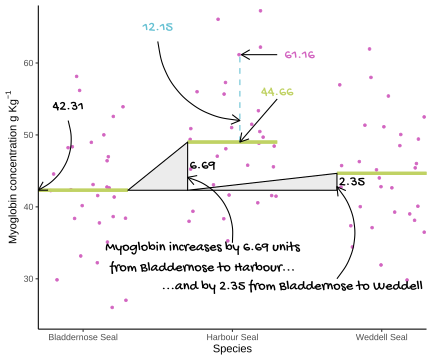
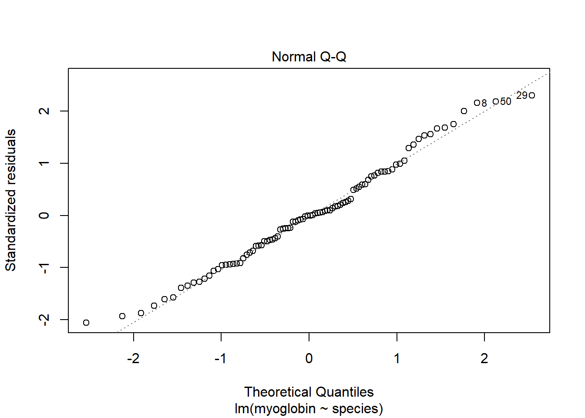
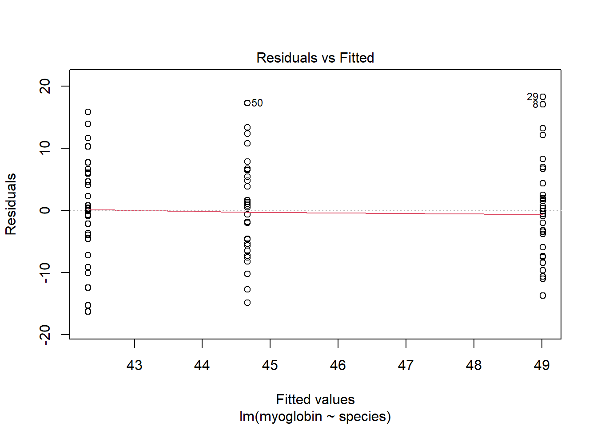

# One-way ANOVA revisited {#one-way-anova-revisit}

## Introduction to the example
The myoglobin concentration of skeletal muscle of three species of seal in grams per kilogram of muscle was determined and the data are given in [seal.txt](data-raw/seal.text). We want to know if there is a difference in myoglobin concentration between species. Each row represents an individual seal.


Figure \@ref(fig:weddell-fig)

(ref:weddell-fig) Baby Weddell Seals are very cute. By Photo © Samuel Blanc, CC BY-SA 3.0, https://commons.wikimedia.org/w/index.php?curid=3877642

<div class="figure" style="text-align: left">

<p class="caption">(\#fig:weddell-fig)(ref:weddell-fig)</p>
</div>


```r
seal <- read_delim("data-raw/seal.txt", delim = " ")
seal$species <- factor(seal$species)
```

make a factor because we will later use an r function that demands that


```r
# create a rough plot of the data  
ggplot(data = seal, aes(x = species, y = myoglobin)) +
  geom_violin()
```


```r
seal_summary <- seal %>%
  group_by(species) %>%
  summarise(mean = mean(myoglobin),
            std = sd(myoglobin),
            n = length(myoglobin),
            se = std/sqrt(n))
```


species             mean    std    n     se
-----------------  -----  -----  ---  -----
Bladdernose Seal    42.3   8.02   30   1.46
Harbour Seal        49.0   8.25   30   1.51
Weddell Seal        44.7   7.85   30   1.43


## `aov()` output reminder


```r
mod <- aov(data = seal, myoglobin ~ species)
```


```r
summary(mod)
#             Df Sum Sq Mean Sq F value Pr(>F)   
# species      2    692     346    5.35 0.0064 **
# Residuals   87   5627      65                  
# ---
# Signif. codes:  0 '***' 0.001 '**' 0.01 '*' 0.05 '.' 0.1 ' ' 1
```


There was a significant difference in myoglobin concentration between Seal species (ANOVA: $F$ = 5.352; $d.f.$ = 2, 87; $p$ = 0.006). We need a post-hoc test to discover which comparisons are significant.

## Post-hoc testing for `aov()`

```r
TukeyHSD(mod)
#   Tukey multiple comparisons of means
#     95% family-wise confidence level
# 
# Fit: aov(formula = myoglobin ~ species, data = seal)
# 
# $species
#                                diff   lwr    upr p adj
# Harbour Seal-Bladdernose Seal  6.69  1.74 11.646 0.005
# Weddell Seal-Bladdernose Seal  2.34 -2.61  7.296 0.499
# Weddell Seal-Harbour Seal     -4.35 -9.30  0.602 0.097
```

Post-hoc testing revealed the difference to be between the Harbour Seal with the highest myoglobin concentrations ($\bar{x} \pm s.e.$: 49.01 $\pm$ 1.507) ) and the Bladdernose Seal with the lowest ($\bar{x} \pm s.e.$: 42.316 $\pm$ 1.464). 

## Applying and interpreting `lm()`


```r
mod <- lm(data = seal, myoglobin ~ species)
```


```r
mod
# 
# Call:
# lm(formula = myoglobin ~ species, data = seal)
# 
# Coefficients:
#         (Intercept)  speciesHarbour Seal  speciesWeddell Seal  
#               42.32                 6.69                 2.34
```


The mean of Bladdernose Seals is (42.32). It is the intercept ($\beta_{0}$) because "Bladdernose Seal" comes before "Harbour Seal" and "Weddell Seal" in the alphabet.
The value labelled "speciesHarbour Seal" is the difference between the intercept and the Harbour Seal mean. It indicates that you have to add 6.69 to 42.32 to get the Harbour Seal mean

The value labelled "speciesWedell Seal" is also relative to the intercept. The value of 2.34 must be added to 42.32 to get the Weddell Seal mean.
 

## Getting predictions from the model


```r
predictions <- data.frame(species = seal_summary$species)
```


```r
predictions$pred <- predict(mod, newdata = predictions)
```

## Link to Chapter 2.1

Replacing the terms shown in Figure \@ref(fig:lm-annotated) with the values in this example gives us \@ref(fig:one-way-annotated).

(ref:one-way-annotated) The annotated model with the values from the myoglobin content of seal muscle example. The measured <span style=" font-weight: bold;    color: #d264c0 !important;" >response values are in pink</span>, the <span style=" font-weight: bold;    color: #c0d264 !important;" >predictions are in green</span>, and the <span style=" font-weight: bold;    color: #64c0d2 !important;" >residuals, are in blue</span>. One example of a measured value, a predicted value and the residual is shown for a Harbour Seal individual. The estimated model parameters, $\beta_{0}$ and $\beta_{1}$ are indicated. Compare to Figure \@ref(fig:lm-annotated).

<div class="figure" style="text-align: left">

<p class="caption">(\#fig:one-way-annotated)(ref:one-way-annotated)</p>
</div>


## Checking assumptions


```r
plot(mod, which = 2)
plot(mod, which = 1)
shapiro.test(mod$res)
# 
# 	Shapiro-Wilk normality test
# 
# data:  mod$res
# W = 1, p-value = 0.4
```



## Post-hoc testing for `lm()`


```r
library(multcomp)
```

generic example. define linfct, mcp multiple comparion procedures
```


```


```r
mod_mc <- glht(mod, linfct = mcp(species = "Tukey"))
summary(mod_mc)
# 
# 	 Simultaneous Tests for General Linear Hypotheses
# 
# Multiple Comparisons of Means: Tukey Contrasts
# 
# 
# Fit: lm(formula = myoglobin ~ species, data = seal)
# 
# Linear Hypotheses:
#                                      Estimate Std. Error t value Pr(>|t|)   
# Harbour Seal - Bladdernose Seal == 0     6.69       2.08    3.22    0.005 **
# Weddell Seal - Bladdernose Seal == 0     2.34       2.08    1.13    0.499   
# Weddell Seal - Harbour Seal == 0        -4.35       2.08   -2.09    0.097 . 
# ---
# Signif. codes:  0 '***' 0.001 '**' 0.01 '*' 0.05 '.' 0.1 ' ' 1
# (Adjusted p values reported -- single-step method)
```

## Creating a figure


```r
#summarise the data 

ggplot() +
  geom_jitter(data = seal, 
              aes(x = species, y = myoglobin), 
              width = 0.25, colour = "grey") +
  geom_errorbar(data = seal_summary,
                aes(x = species,
                    ymin = mean,
                    ymax = mean),
                width = .3) +
  geom_errorbar(data = seal_summary,
                aes(x = species,
                    ymin = mean - se,
                    ymax = mean + se),
                width = .5) +
  geom_segment(aes(x = 1, y = 71, xend = 3, yend = 71),
               size = 1) +
  geom_segment(aes(x = 1, y = 71, xend = 1, yend = 69),
               size = 1) +
  geom_segment(aes(x = 3, y = 71, xend = 3, yend = 69),
               size = 1) +
  annotate("text", x = 2, y = 73,  label = "**", size = 6) +
  scale_x_discrete(name = "Species") +
  scale_y_continuous(name = expression("Myoglobin concentration g "*Kg^{-1}),
                     expand = c(0, 0),
                     limits = c(0, 75)) +
  theme_classic()
```


## Reporting the results

```r
# res <- summary(mod)
# tval <- res$coefficients["specieswild", "t value"]
# df <- res$df[2]
```


There is a significant difference in myoglobin concentration between Seal species (ANOVA: $F$ = 5.352; $d.f.$ = 2, 87; $p$ = 0.006). Post-hoc testing revealed that difference to be between the Harbour Seal with the highest myoglobin concentrations ($\bar{x} \pm s.e.$: 49.01 $\pm$ 1.507) ) and the Bladdernose Seal with the lowest ($\bar{x} \pm s.e.$: 42.316 $\pm$ 1.464). See figure \@ref(fig:fig-one-anova-report).

(ref:fig-one-anova-report) Muscle myoglobin content of three seal species. 

<div class="figure" style="text-align: left">

<p class="caption">(\#fig:fig-one-anova-report)(ref:fig-one-anova-report)</p>
</div>


