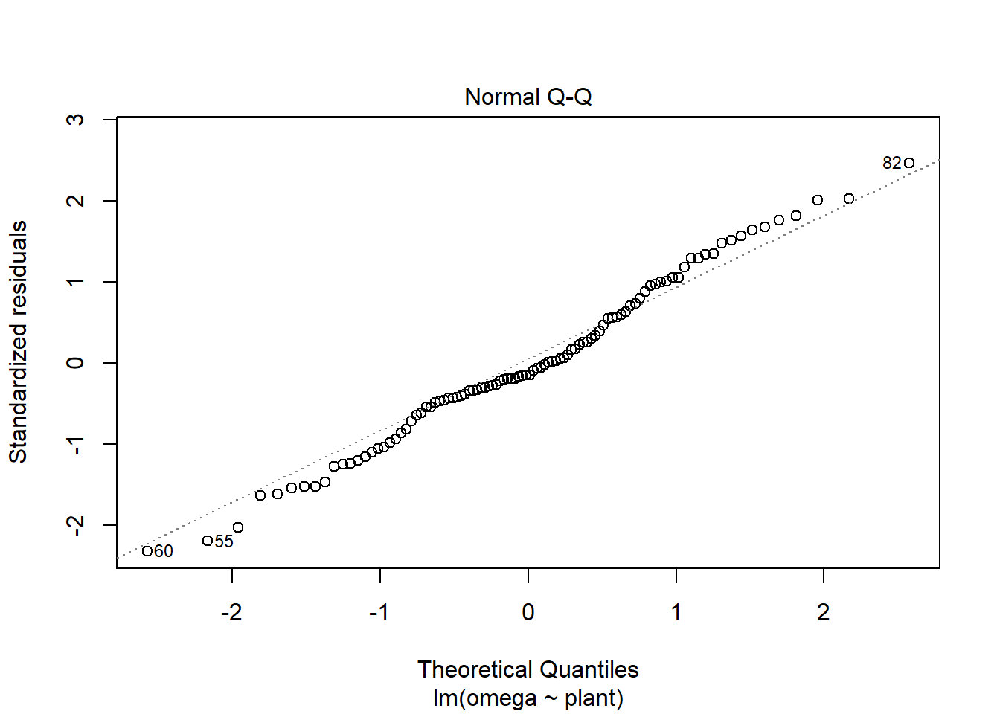

# What are linear models {#revisit}

## Introduction
 - what is meant by a linear model
 - revise regression
 - revise t.tests
 - doing t.tests as linear models
 - linking output of t.test to lm
 - revise one way ANOVA
 - linking output of aov to lm
 - revise two way ANOVA
 - doing two way ANOVA as linear models
 - linking output of aov to lm
 - extensible - ancova design

## What is a linear model?
A linear model describes a continuous response variable as a function of one or more explanatory variables. When you have a single explanatory variable, that model is:

\begin{equation}
y_{i}=\beta_{0}+\beta_{1}X1_{i}+e_{i}
(\#eq:lm1)
\end{equation}

Where:  

 - The response variable is $y$ and $X1$ is the explanatory variable.  
 - $\beta_{0}$ and $\beta_{1}$ are the coefficients in the model. In a single linear regression, $\beta_{0}$ is often called the intercept and $\beta_{1}$ the slope.  
 - $i$ is the index of the response so $y_{i}$ is the $i$th response; if you had 20 pairs of $x$-$y$ values, $i$ would go from 1 to 20.  
 - $e_{i}$ is the "error" also known as the residual. 

The equation means the response  can be predicted from a given value of the explanatory variable, $\beta_{0}$ and $\beta_{1}$ and will take that value plus some random noise. When you build a linear model from your data the procedure estimates the model coefficients.

See figure \@ref(fig:lm-annotated).

(ref:lm-annotated) Terms used in linear models. 

<div class="figure" style="text-align: center">

<p class="caption">(\#fig:lm-annotated)(ref:lm-annotated)</p>
</div>


**keypoint**
terminology build fit
parameter, coefficient
estimates

If you have more than one explanatory variable this these are given as $X2$,  $X3$ and so on up to the $p$th explanatory variable each with its own $\beta$ coefficient. The general form of the model is:
\begin{equation}
y_{i}=\beta_{0}+\beta_{1}X1_{i}+\beta_{2}X2_{i}+...+\beta_{p}XP_{i}+e_{i}
(\#eq:regression)
\end{equation}

## Single linear regression

### Introduction to the example
This is a test you have probably carried out before.

The concentration of juvenile hormone in stag beetles (*Lucanus cervus*) is known to influence mandible growth. Groups of stag beetles were injected with different concentrations of juvenile hormone (pg$\mu$l^-1^) and their average mandible size (mm) determined. The data are in [stag.txt](data-raw/stag.txt).

We will import the data with the `read_table2()` function from the `readr` package and plot it with `ggplot()` from the `ggplot2` package. Both packages are part of the tidyverse and we load this first:


```r
library(tidyverse)
```


```r
stag <- read_table2("data-raw/stag.txt")
```

Juvenile hormone is has been set by the experimenter and mandible size has decimal places and is something we would expect to be normally distributed. Visualising our data before any further analysis is usually sensible. In this case, it will help us determine if any relationship between the two variables is linear.


```r
ggplot(data = stag, aes(x = jh, y = mand)) +
        geom_point()
```


The relationship between them looks roughly linear. So far, common sense suggests the assumptions of regression are met.

### Applying and interpreting `lm()`

The `lm()` function is used to build the regression model


```r
# build the statistical model
mod <- lm(data = stag, mand ~ jh)
```


This can be read as: fit a linear of model of mandible size explained by juvenile growth hormone concentration. 

Printing `mod` to the console will reveal the estimated model parameters (coefficients) but little else:


```r
mod
# 
# Call:
# lm(formula = mand ~ jh, data = stag)
# 
# Coefficients:
# (Intercept)           jh  
#    0.419338     0.006459
```


$\beta_{0}$ is labelled "(Intercept)" and $\beta_{1}$ is labelled "jh". Thus the equation of the line is:

$mand$ = 0.4193382 + 0.0064588$jh$

More information including statistical tests of the model and its parameters is obtained by using `summary()`

```r
# examine it
summary(mod)
# 
# Call:
# lm(formula = mand ~ jh, data = stag)
# 
# Residuals:
#      Min       1Q   Median       3Q      Max 
# -0.38604 -0.20281 -0.09751  0.15034  0.60690 
# 
# Coefficients:
#             Estimate Std. Error t value Pr(>|t|)   
# (Intercept) 0.419338   0.139429   3.008  0.00941 **
# jh          0.006459   0.001584   4.078  0.00113 **
# ---
# Signif. codes:  0 '***' 0.001 '**' 0.01 '*' 0.05 '.' 0.1 ' ' 1
# 
# Residual standard error: 0.292 on 14 degrees of freedom
# Multiple R-squared:  0.5429,	Adjusted R-squared:  0.5103 
# F-statistic: 16.63 on 1 and 14 DF,  p-value: 0.00113
```

The "Coefficients:" table gives the estimated $\beta_{0}$ and $\beta_{1}$ again, this time with their standard errors and tests of whether the estimates differ from zero. The estimated value for the intercept is 0.4193382 $\pm$ 0.1394289 and this differs significantly from zero ($p$ = 0.0094098). The estimated value for the slope, 0.0064588 $\pm$ 0.0015838, also differs significantly from zero ($p$ = 0.0011296). 


The three lines at the bottom of the output gives information about the fit of the model to the data. The "Multiple R-squared" gives the proportion of the variance in the response which is explained by the model. In our case, 0.542938 of the variance in mandible length is explained by the model and this is a significant proportion of that variance ($p$ = 0.0011296). 


For a single linear regression, the *p*-value for the model and the *p*-value for the slope are the same. This is also true for linear models in the form of a two-sample *t*-test but **not** the case for other linear models.

### Getting predictions from the model

The `predict()` returns the predicted values of the response. To add a column of predicted values to the dataframe: 


```r
stag$pred <- predict(mod)
```

This requires creating a data frame of the x values from which you want to predict

```r
predictions <- data.frame(jh = seq(0, 150, 5))
```

Note that the name and type of value of explanatory variable must be the same as it is in the model


```r
predictions$pred <- predict(mod, newdata = predictions)

```

Replacing the terms shown in Figure \@ref(fig:lm-annotated) with the values in this example gives us \@ref(fig:stag-annotated).

(ref:stag-annotated) these model estimates. 

<div class="figure" style="text-align: center">

<p class="caption">(\#fig:stag-annotated)(ref:stag-annotated)</p>
</div>


### Checking assumptions


```r
plot(mod, which = 2)
plot(mod, which = 1)
shapiro.test(mod$res)
# 
# 	Shapiro-Wilk normality test
# 
# data:  mod$res
# W = 0.94737, p-value = 0.4493
```


### Creating a figure


```r
ggplot(data = stag, aes(x = jh, y = mand)) +
        geom_point() +
        scale_x_continuous(expand = c(0.01, 0),
                           limits = c(0, 160),
                           name = expression(paste("Juvenile hormone (pg",
                                                   mu,
                                                   l^-1,
                                                   ")"))) +
        scale_y_continuous(expand = c(0, 0),
                           limits = c(0, 2),
                           name = "Mandible length (mm)") +
        geom_smooth(method = lm, se = FALSE, colour = "black") +
        theme_classic()
```


### Reporting the results

There was a significant positive relationship between the concentration of Juvenile hormone and mandible length ($\beta_{1}\pm s.e.$: 0.0064588 $\pm$ 0.0015838; $p$ = 0.0011296). See figure \@ref(fig:ch1-reg-report).

(ref:ch1-reg-report) Relationship between the concentration of Juvenile hormone and mandible length. 

<div class="figure" style="text-align: left">

<p class="caption">(\#fig:ch1-reg-report)(ref:ch1-reg-report)</p>
</div>


## t-tests

### Introduction to the example

Some plant biotechnologists developed a genetically modified line of *Cannabis sativa* to increase its omega 3 fatty acids content. They grew 50 wild type and fifty modified plants to maturity, collect the seeds and measure the amount of omega 3 fatty acids. The data are in [csativa.txt](data-raw/csativa.txt). They used a two-sample *t*-test to compare the mean omega 3 content in the two plant types. 

We again use the `read_table2()` function to import the data and visualise it with `ggplot()`

```r
csativa  <-  read_table2("data-raw/csativa.txt")
```


```r
# create a rough plot of the data  
ggplot(data = csativa, aes(x = plant, y = omega)) +
  geom_violin()
```


The modified plant have a lower mean omega 3 content than the wildtype plants. The modification appears not to be successful.

Statistical comparison of the two means can be done with either the `t.test()` or `lm()` functions; these are exactly equivalent but present the results differently. We will use our understanding of applying and interpreting `t.test()` to develop our understanding of `lm()` output

### `t.test()` output reminder

```r
t.test(data = csativa, omega ~ plant, var.equal = TRUE)
# 
# 	Two Sample t-test
# 
# data:  omega by plant
# t = -5.0289, df = 98, p-value = 2.231e-06
# alternative hypothesis: true difference in means is not equal to 0
# 95 percent confidence interval:
#  -9.687828 -4.205372
# sample estimates:
# mean in group modif  mean in group wild 
#             49.4652             56.4118
```

The two groups means are give in the section labelled "sample estimates" and the test of whether they differ significantly is given in the forth line (beginning "t = ..."). We conclude the mean omega 3 content of the modified plants (49.4652) is significantly lower than that of the wildtype plants ($t$ = 5.0288776, $d.f.$ = 98, $p$ = 2.2305939\times 10^{-6}).

The confidence interval is on the difference between the two means.

The sign on the $t$ value and the order in which the sample estimates are given is determined by R's alphabetical ordering of the groups. As "modif" comes before "wildtype" in the alphabet, "modif" is the first group and the test is the modified plant mean minus the wildtype mean. This has no impact on our conclusions and had the wildtype plants been labelled "control" the output would be:

```
	Two Sample t-test

data:  omega by plant
t = 5.0289, df = 98, p-value = 2.231e-06
alternative hypothesis: true difference in means is not equal to 0
95 percent confidence interval:
 4.205372 9.687828
sample estimates:
mean in group control  mean in group modif
            56.4118             49.4652

```

### Applying and interpreting `lm()`

The `lm()` function is used as follows:

```r
# build a model with `lm()`
mod <- lm(omega ~ plant, data = csativa)
```

This can be read as: fit a linear of model of omega content explained by plant type. Printing `mod` to the console gives us these estimated model parameters (coefficients):


```r
mod
# 
# Call:
# lm(formula = omega ~ plant, data = csativa)
# 
# Coefficients:
# (Intercept)    plantwild  
#      49.465        6.947
```


```r
summary(mod)
# 
# Call:
# lm(formula = omega ~ plant, data = csativa)
# 
# Residuals:
#      Min       1Q   Median       3Q      Max 
# -15.8718  -3.7026  -0.9635   4.4598  16.9182 
# 
# Coefficients:
#             Estimate Std. Error t value Pr(>|t|)    
# (Intercept)  49.4652     0.9768  50.642  < 2e-16 ***
# plantwild     6.9466     1.3813   5.029 2.23e-06 ***
# ---
# Signif. codes:  0 '***' 0.001 '**' 0.01 '*' 0.05 '.' 0.1 ' ' 1
# 
# Residual standard error: 6.907 on 98 degrees of freedom
# Multiple R-squared:  0.2051,	Adjusted R-squared:  0.197 
# F-statistic: 25.29 on 1 and 98 DF,  p-value: 2.231e-06
anova(mod)
# Analysis of Variance Table
# 
# Response: omega
#           Df Sum Sq Mean Sq F value    Pr(>F)    
# plant      1 1206.4  1206.4   25.29 2.231e-06 ***
# Residuals 98 4674.9    47.7                      
# ---
# Signif. codes:  0 '***' 0.001 '**' 0.01 '*' 0.05 '.' 0.1 ' ' 1
```


### Getting predictions from the model


```r
predict(mod)
#       1       2       3       4       5       6       7       8       9      10 
# 49.4652 49.4652 49.4652 49.4652 49.4652 49.4652 49.4652 49.4652 49.4652 49.4652 
#      11      12      13      14      15      16      17      18      19      20 
# 49.4652 49.4652 49.4652 49.4652 49.4652 49.4652 49.4652 49.4652 49.4652 49.4652 
#      21      22      23      24      25      26      27      28      29      30 
# 49.4652 49.4652 49.4652 49.4652 49.4652 49.4652 49.4652 49.4652 49.4652 49.4652 
#      31      32      33      34      35      36      37      38      39      40 
# 49.4652 49.4652 49.4652 49.4652 49.4652 49.4652 49.4652 49.4652 49.4652 49.4652 
#      41      42      43      44      45      46      47      48      49      50 
# 49.4652 49.4652 49.4652 49.4652 49.4652 49.4652 49.4652 49.4652 49.4652 49.4652 
#      51      52      53      54      55      56      57      58      59      60 
# 56.4118 56.4118 56.4118 56.4118 56.4118 56.4118 56.4118 56.4118 56.4118 56.4118 
#      61      62      63      64      65      66      67      68      69      70 
# 56.4118 56.4118 56.4118 56.4118 56.4118 56.4118 56.4118 56.4118 56.4118 56.4118 
#      71      72      73      74      75      76      77      78      79      80 
# 56.4118 56.4118 56.4118 56.4118 56.4118 56.4118 56.4118 56.4118 56.4118 56.4118 
#      81      82      83      84      85      86      87      88      89      90 
# 56.4118 56.4118 56.4118 56.4118 56.4118 56.4118 56.4118 56.4118 56.4118 56.4118 
#      91      92      93      94      95      96      97      98      99     100 
# 56.4118 56.4118 56.4118 56.4118 56.4118 56.4118 56.4118 56.4118 56.4118 56.4118
```


```r
predictions <- data.frame(plant = c("modif", "wild"))
```


```r
predictions$pred <- predict(mod, newdata = predictions, interval = "prediction")
```


```r
predictions$pred <- predict(mod, newdata = predictions)
```


Replacing the terms shown in Figure \@ref(fig:lm-annotated) with the values in this example gives us \@ref(fig:csat-annotated).

(ref:csat-annotated) these model estimates. 

<div class="figure" style="text-align: center">

<p class="caption">(\#fig:csat-annotated)(ref:csat-annotated)</p>
</div>


### Checking assumptions


```r
plot(mod, which = 2)
plot(mod, which = 1)
shapiro.test(mod$res)
# 
# 	Shapiro-Wilk normality test
# 
# data:  mod$res
# W = 0.98816, p-value = 0.5204
```



### Creating a figure


```r
csativa_summary <- csativa %>%
  group_by(plant) %>%
  summarise(mean = mean(omega),
            std = sd(omega),
            n = length(omega),
            se = std/sqrt(n))
```


```r
#summarise the data 

ggplot() +
  geom_jitter(data = csativa, 
              aes(x = plant, y = omega), 
              width = 0.2, colour = "grey") +
  geom_errorbar(data = csativa_summary,
                aes(x = plant,
                    ymin = mean,
                    ymax = mean),
                width = .1) +
  geom_errorbar(data = csativa_summary,
                aes(x = plant,
                    ymin = mean - se,
                    ymax = mean + se),
                width = .2) +
  xlab("Plant type") +
  ylab("Amount of Omega 3 (units)") +
  ylim(0, 75) +
  scale_x_discrete(labels = c("Modified", "Wild Type")) +
  theme_classic()
```


### Reporting the results


## One-way ANOVA

### aov()

### lm()

### link between the outputs

### post-hoc for lm()

### reporting from lm()

including a figure

## Two-way ANOVA

### aov()

### lm()

### link between the outputs

### post-hoc for lm()

### reporting from lm()

including a figure

##


