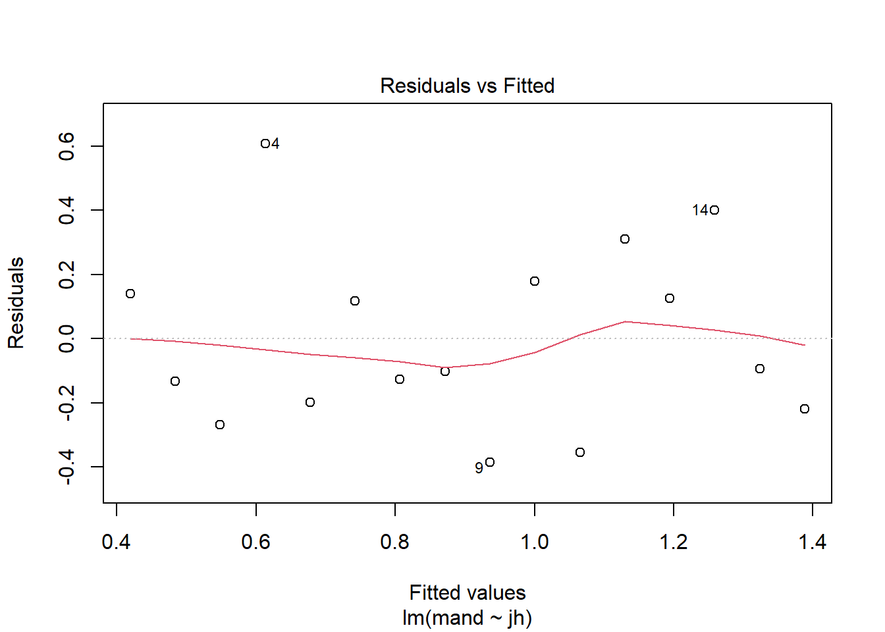

# (PART) USING `lm()` FOR FAMILIAR TESTS {-}

# Single linear regression {#single-regression}

This is probably the one general linear model you have applied out using `lm()` previously and it is covered here as revision and make more clear links between regression, *t*-tests and ANOVA.

## Introduction to the example

(ref:lucanus-fig) Male stag beetles *Lucanus cervus*, have large mandibles that resemble the antlers of a stag and give them their common and scientific name (*Cervus* is a genus of deer). By Simon A. Eugster - Own work, CC BY 3.0, https://commons.wikimedia.org/w/index.php?curid=7790887

<div class="figure" style="text-align: left">

<p class="caption">(\#fig:lucanus-fig)(ref:lucanus-fig)</p>
</div>

The concentration of Juvenile growth hormone in male stag beetles (*Lucanus cervus*) is known to influence mandible growth. See Figure \@ref(fig:lucanus-fig)

Groups of ten stag beetles were treated with different concentrations of Juvenile growth hormone (pg$\mu$l^-1^) and their average mandible size (mm) determined. The data are in [stag.txt](data-raw/stag.txt). Juvenile hormone is has been set by the experimenter and we would expect mandible size to be normally distributed. 

<div style="border: 1px solid #ddd; padding: 0px; overflow-y: scroll; height:300px; overflow-x: scroll; width:300px; "><table class="table" style="margin-left: auto; margin-right: auto;">
 <thead>
  <tr>
   <th style="text-align:right;position: sticky; top:0; background-color: #FFFFFF;"> jh </th>
   <th style="text-align:right;position: sticky; top:0; background-color: #FFFFFF;"> mand </th>
  </tr>
 </thead>
<tbody>
  <tr>
   <td style="text-align:right;"> 0 </td>
   <td style="text-align:right;"> 0.56 </td>
  </tr>
  <tr>
   <td style="text-align:right;"> 10 </td>
   <td style="text-align:right;"> 0.35 </td>
  </tr>
  <tr>
   <td style="text-align:right;"> 20 </td>
   <td style="text-align:right;"> 0.28 </td>
  </tr>
  <tr>
   <td style="text-align:right;"> 30 </td>
   <td style="text-align:right;"> 1.22 </td>
  </tr>
  <tr>
   <td style="text-align:right;"> 40 </td>
   <td style="text-align:right;"> 0.48 </td>
  </tr>
  <tr>
   <td style="text-align:right;"> 50 </td>
   <td style="text-align:right;"> 0.86 </td>
  </tr>
  <tr>
   <td style="text-align:right;"> 60 </td>
   <td style="text-align:right;"> 0.68 </td>
  </tr>
  <tr>
   <td style="text-align:right;"> 70 </td>
   <td style="text-align:right;"> 0.77 </td>
  </tr>
  <tr>
   <td style="text-align:right;"> 80 </td>
   <td style="text-align:right;"> 0.55 </td>
  </tr>
  <tr>
   <td style="text-align:right;"> 90 </td>
   <td style="text-align:right;"> 1.18 </td>
  </tr>
  <tr>
   <td style="text-align:right;"> 100 </td>
   <td style="text-align:right;"> 0.71 </td>
  </tr>
  <tr>
   <td style="text-align:right;"> 110 </td>
   <td style="text-align:right;"> 1.44 </td>
  </tr>
  <tr>
   <td style="text-align:right;"> 120 </td>
   <td style="text-align:right;"> 1.32 </td>
  </tr>
  <tr>
   <td style="text-align:right;"> 130 </td>
   <td style="text-align:right;"> 1.66 </td>
  </tr>
  <tr>
   <td style="text-align:right;"> 140 </td>
   <td style="text-align:right;"> 1.23 </td>
  </tr>
  <tr>
   <td style="text-align:right;"> 150 </td>
   <td style="text-align:right;"> 1.17 </td>
  </tr>
</tbody>
</table></div>

:::key
There are 2 variables: `jh`, the concentration of Juvenile growth hormone and `mand`, the average mandible size (mm) of 10 stag beetles
:::


We will import the data with the `read_table2()` function from the **`readr`** package and plot it with `ggplot()` from the **`ggplot2`** package. Both packages are part of the tidyverse.

Import the data:

```r
stag <- read_table2("data-raw/stag.txt")

```


Visualising our data before any further analysis is sensible. In this case, it will help us determine if any relationship between the two variables is linear.
A simple scatter plot is appropriate.


```r
ggplot(data = stag, aes(x = jh, y = mand)) +
        geom_point()
```


The relationship between the two variables looks roughly linear. So far, common sense suggests the assumptions of regression are met.

## Applying and interpreting `lm()`

The `lm()` function is used to build the regression model:


```r
mod <- lm(data = stag, mand ~ jh)
```


This can be read as: fit a linear of model of mandible size explained by the concentration of Juvenile growth hormone.

Printing `mod` to the console will reveal the estimated model parameters (coefficients) but little else:


```r
mod
# 
# Call:
# lm(formula = mand ~ jh, data = stag)
# 
# Coefficients:
# (Intercept)           jh  
#     0.41934      0.00646
```


$\beta_{0}$ is labelled `(Intercept)` and $\beta_{1}$ is labelled `jh`. Thus, the equation of the line is:

<center> $mand$ = 0.419 + 0.006$jh$ </center>

More information including statistical tests of the model and its parameters is obtained by using `summary()`:

```r
summary(mod)
# 
# Call:
# lm(formula = mand ~ jh, data = stag)
# 
# Residuals:
#     Min      1Q  Median      3Q     Max 
# -0.3860 -0.2028 -0.0975  0.1503  0.6069 
# 
# Coefficients:
#             Estimate Std. Error t value Pr(>|t|)   
# (Intercept)  0.41934    0.13943    3.01   0.0094 **
# jh           0.00646    0.00158    4.08   0.0011 **
# ---
# Signif. codes:  0 '***' 0.001 '**' 0.01 '*' 0.05 '.' 0.1 ' ' 1
# 
# Residual standard error: 0.292 on 14 degrees of freedom
# Multiple R-squared:  0.543,	Adjusted R-squared:  0.51 
# F-statistic: 16.6 on 1 and 14 DF,  p-value: 0.00113
```

The `Coefficients` table gives the estimated $\beta_{0}$ and $\beta_{1}$ again but along with their standard errors and tests of whether the estimates differ from zero. The estimated value for the intercept is 0.419 $\pm$ 0.139 and this differs significantly from zero ($p$ = 0.009). The estimated value for the slope is 0.006 $\pm$ 0.002, also differs significantly from zero ($p$ = 0.001). 

The three lines at the bottom of the output give information about the fit of the model to the data. The `Multiple R-squared` gives the proportion of the variance in the response which is explained by the model. In our case, 0.543 of the variance in mandible length is explained by the model and this is a significant proportion of that variance ($p$ = 0.001). 


The *p*-value for the model and the *p*-value for the slope are the same in a single linear regression because, except for the intercept, there is only one parameter (the slope) in the model. Linear models in the form of a two-sample *t*-test also estimate just one parameter and its *p*-value will also equal the model *p*-value. This is **not** the case for other linear models.

## Link to Chapter 2.1

The estimated coefficients tell us mandible size is predicted to be 0.419 when Juvenile growth hormone is zero and increases by 0.006 mm for each pg$\mu$l^-1^ of Juvenile growth hormone. 

At a Juvenile growth hormone of 1 pg$\mu$l^-1^  the mandible is predicted to be 0.419 + 0.006 = 0.426 mm. 

At 2 pg$\mu$l^-1^ the predicted mandible size is 0.419 + 0.006 + 0.006 = 0.432 mm. 


In general mandible size is: $\beta_{0}$ + $x\times\beta_{0}$ mm at $x$ pg$\mu$l^-1^. See Figure \@ref(fig:stag-annotated) for a version of Figure \@ref(fig:lm-annotated) annotated with values from this example.

(ref:stag-annotated) The model annotated with values from the stag beetle example. The measured <span style=" font-weight: bold;    color: #d264c0 !important;" >response values are in pink</span>, the <span style=" font-weight: bold;    color: #c0d264 !important;" >predictions are in green</span>, and the <span style=" font-weight: bold;    color: #64c0d2 !important;" >residuals, are in blue</span>. One example of a measured value, a predicted value and the residual is shown for a  Juvenile hormone of 130 pg$\mu$l^-1^. The estimated model parameters, $\beta_{0}$ and $\beta_{1}$ are indicated. Compare to Figure \@ref(fig:lm-annotated).

<div class="figure" style="text-align: left">

<p class="caption">(\#fig:stag-annotated)(ref:stag-annotated)</p>
</div>


## Getting predictions from the model

The `predict()` returns the predicted values of the response. To add a column of predicted values to the `stag` dataframe we use: 


```r
stag$pred <- predict(mod)
glimpse(stag)
# Rows: 16
# Columns: 3
# $ jh   <dbl> 0, 10, 20, 30, 40, 50, 60, 70, 80, 90, 100, 110, 120, 130, 140...
# $ mand <dbl> 0.56, 0.35, 0.28, 1.22, 0.48, 0.86, 0.68, 0.77, 0.55, 1.18, 0....
# $ pred <dbl> 0.419, 0.484, 0.549, 0.613, 0.678, 0.742, 0.807, 0.871, 0.936,...
```
This gives predictions for the actual Juvenile growth hormone concentration values used. If you want predictions for other values, you need to create a data frame of the Juvenile growth hormone values from which you want to predict. 
The following creates a dataframe with one column of Juvenile growth hormone values from 0 to 150 in steps of 5:

```r
predict_for <- data.frame(jh = seq(0, 150, 5))
glimpse(predict_for)
# Rows: 31
# Columns: 1
# $ jh <dbl> 0, 5, 10, 15, 20, 25, 30, 35, 40, 45, 50, 55, 60, 65, 70, 75, 80...
```

Note that the column is named `jh` - the same as in the dataset and the model. Its variable type must also match.

:::key
To predict responses for a new set of explanatory variable values, the name and type of explanatory variables in the new set must match those in the model.
:::

To get predicted mandible sizes for the Juvenile growth hormone values we use:

```r
predict_for$pred <- predict(mod, newdata = predict_for)
glimpse(predict_for)
# Rows: 31
# Columns: 2
# $ jh   <dbl> 0, 5, 10, 15, 20, 25, 30, 35, 40, 45, 50, 55, 60, 65, 70, 75, ...
# $ pred <dbl> 0.419, 0.452, 0.484, 0.516, 0.549, 0.581, 0.613, 0.645, 0.678,...
```


## Checking assumptions

The two assumptions of the model can be checked using diagnostic plots. The Q-Q plot is obtained with:

```r
plot(mod, which = 2)
```


This sample is relatively small so we should expect more wiggliness than we saw in 2.2 but this looks OK.

Let's look at the Residuals vs Fitted plot:


```r
plot(mod, which = 1)
```



Again the red line wiggles a little but there is no particular pattern and it appears that the variance is homogeneous along mandible size.

## Creating a figure

A suitable figure includes the data themselves and the model fitted:

```r
ggplot(data = stag, aes(x = jh, y = mand)) +
        geom_point() +
        scale_x_continuous(expand = c(0.01, 0),
                           limits = c(0, 160),
                           name = expression(paste("Juvenile growth hormone (pg",
                                                   mu,
                                                   l^-1,
                                                   ")"))) +
        scale_y_continuous(expand = c(0, 0),
                           limits = c(0, 2),
                           name = "Mandible length (mm)") +
        geom_smooth(method = lm, se = FALSE, colour = "black") +
        theme_classic()
```


## Reporting the results

*to add: principle, sig, magnitude and diection of effects, test result, figure*


There was a significant positive relationship between the concentration of Juvenile growth hormone and mandible length ($\beta_{1}\pm s.e.$: 0.006 $\pm$ 0.002; $p$ = 0.001). See figure \@ref(fig:fig-reg-report).

(ref:fig-reg-report) Relationship between the concentration of Juvenile growth hormone and mandible length. 

<div class="figure" style="text-align: left">

<p class="caption">(\#fig:fig-reg-report)(ref:fig-reg-report)</p>
</div>


