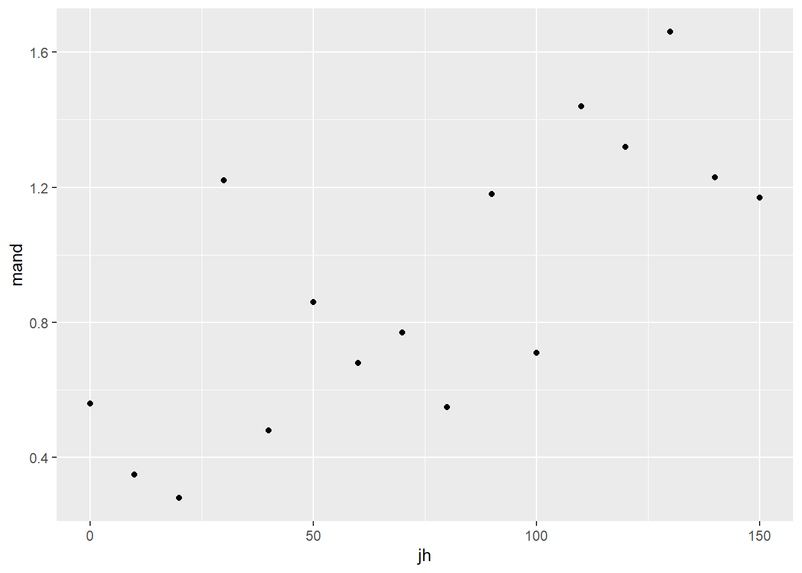

# Single linear regression

## Introduction to the example
This is a test you have probably carried out before.

The concentration of juvenile hormone in stag beetles (*Lucanus cervus*) is known to influence mandible growth. Groups of stag beetles were injected with different concentrations of juvenile hormone (pg$\mu$l^-1^) and their average mandible size (mm) determined. The data are in [stag.txt](data-raw/stag.txt).

We will import the data with the `read_table2()` function from the `readr` package and plot it with `ggplot()` from the `ggplot2` package. Both packages are part of the tidyverse.


```r
stag <- read_table2("data-raw/stag.txt")
```

Juvenile hormone is has been set by the experimenter and mandible size has decimal places and is something we would expect to be normally distributed. Visualising our data before any further analysis is usually sensible. In this case, it will help us determine if any relationship between the two variables is linear.


```r
ggplot(data = stag, aes(x = jh, y = mand)) +
        geom_point()
```


The relationship between them looks roughly linear. So far, common sense suggests the assumptions of regression are met.

## Applying and interpreting `lm()`

The `lm()` function is used to build the regression model


```r
# build the statistical model
mod <- lm(data = stag, mand ~ jh)
```


This can be read as: fit a linear of model of mandible size explained by juvenile growth hormone concentration. 

Printing `mod` to the console will reveal the estimated model parameters (coefficients) but little else:


```r
mod
# 
# Call:
# lm(formula = mand ~ jh, data = stag)
# 
# Coefficients:
# (Intercept)           jh  
#     0.41934      0.00646
```


$\beta_{0}$ is labelled "(Intercept)" and $\beta_{1}$ is labelled "jh". Thus the equation of the line is:

<center> $mand$ = 0.419 + 0.006$jh$ </center>

More information including statistical tests of the model and its parameters is obtained by using `summary()`

```r
# examine it
summary(mod)
# 
# Call:
# lm(formula = mand ~ jh, data = stag)
# 
# Residuals:
#     Min      1Q  Median      3Q     Max 
# -0.3860 -0.2028 -0.0975  0.1503  0.6069 
# 
# Coefficients:
#             Estimate Std. Error t value Pr(>|t|)   
# (Intercept)  0.41934    0.13943    3.01   0.0094 **
# jh           0.00646    0.00158    4.08   0.0011 **
# ---
# Signif. codes:  0 '***' 0.001 '**' 0.01 '*' 0.05 '.' 0.1 ' ' 1
# 
# Residual standard error: 0.292 on 14 degrees of freedom
# Multiple R-squared:  0.543,	Adjusted R-squared:  0.51 
# F-statistic: 16.6 on 1 and 14 DF,  p-value: 0.00113
```

The "Coefficients:" table gives the estimated $\beta_{0}$ and $\beta_{1}$ again, this time with their standard errors and tests of whether the estimates differ from zero. The estimated value for the intercept is 0.419 $\pm$ 0.139 and this differs significantly from zero ($p$ = 0.009). The estimated value for the slope, 0.006 $\pm$ 0.002, also differs significantly from zero ($p$ = 0.001). 


The three lines at the bottom of the output gives information about the fit of the model to the data. The "Multiple R-squared" gives the proportion of the variance in the response which is explained by the model. In our case, 0.543 of the variance in mandible length is explained by the model and this is a significant proportion of that variance ($p$ = 0.001). 


For a single linear regression, the *p*-value for the model and the *p*-value for the slope are the same. This is also true for linear models in the form of a two-sample *t*-test but **not** the case for other linear models.

## Getting predictions from the model

The `predict()` returns the predicted values of the response. To add a column of predicted values to the dataframe: 


```r
stag$pred <- predict(mod)
```

This requires creating a data frame of the x values from which you want to predict

```r
predictions <- data.frame(jh = seq(0, 150, 5))
```

Note that the name and type of value of explanatory variable must be the same as it is in the model


```r
predictions$pred <- predict(mod, newdata = predictions)

```

## Link to Chapter 2.1

Replacing the terms shown in Figure \@ref(fig:lm-annotated) with the values in this example gives us \@ref(fig:stag-annotated).

(ref:stag-annotated) The annotated model with the values from the stag beetle example. The measured <span style=" font-weight: bold;    color: #d264c0 !important;" >response values are in pink</span>, the <span style=" font-weight: bold;    color: #c0d264 !important;" >predictions are in green</span>, and the <span style=" font-weight: bold;    color: #64c0d2 !important;" >residuals, are in blue</span>. One example of a measured value, a predicted value and the residual is shown for a  Juvenile hormone of 130 pg$\mu$l^-1^. The estimated model parameters, $\beta_{0}$ and $\beta_{1}$ are indicated. Compare to Figure \@ref(fig:lm-annotated).

<div class="figure" style="text-align: left">

<p class="caption">(\#fig:stag-annotated)(ref:stag-annotated)</p>
</div>


## Checking assumptions


```r
plot(mod, which = 2)
plot(mod, which = 1)
shapiro.test(mod$res)
# 
# 	Shapiro-Wilk normality test
# 
# data:  mod$res
# W = 0.9, p-value = 0.4
```


## Creating a figure


```r
ggplot(data = stag, aes(x = jh, y = mand)) +
        geom_point() +
        scale_x_continuous(expand = c(0.01, 0),
                           limits = c(0, 160),
                           name = expression(paste("Juvenile hormone (pg",
                                                   mu,
                                                   l^-1,
                                                   ")"))) +
        scale_y_continuous(expand = c(0, 0),
                           limits = c(0, 2),
                           name = "Mandible length (mm)") +
        geom_smooth(method = lm, se = FALSE, colour = "black") +
        theme_classic()
```


## Reporting the results

There was a significant positive relationship between the concentration of Juvenile hormone and mandible length ($\beta_{1}\pm s.e.$: 0.006 $\pm$ 0.002; $p$ = 0.001). See figure \@ref(fig:fig-reg-report).

(ref:fig-reg-report) Relationship between the concentration of Juvenile hormone and mandible length. 

<div class="figure" style="text-align: left">

<p class="caption">(\#fig:fig-reg-report)(ref:fig-reg-report)</p>
</div>


