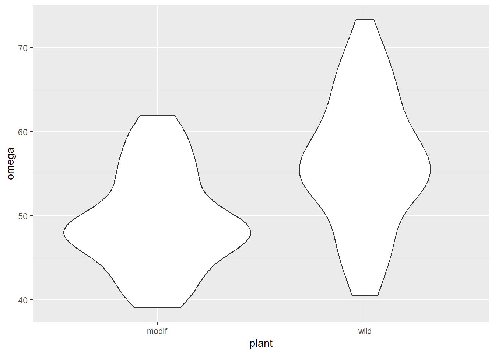

# (PART) USING `lm()` FOR FAMILIAR TESTS {-}

# *t*-tests revisited {#t-tests-revisit}

## Introduction to the example

Some plant biotechnologists developed a genetically modified line of *Cannabis sativa* to increase its omega 3 fatty acids content. They grew 50 wild type and fifty modified plants to maturity, collect the seeds and measure the amount of omega 3 fatty acids. The data are in [csativa.txt](data-raw/csativa.txt). They used a two-sample *t*-test to compare the mean omega 3 content in the two plant types. 

We again use the `read_table2()` function to import the data and visualise it with `ggplot()`


```r
csativa  <-  read_table2("data-raw/csativa.txt")
```


```r
# create a rough plot of the data  
ggplot(data = csativa, aes(x = plant, y = omega)) +
  geom_violin()
```


The modified plant have a lower mean omega 3 content than the wildtype plants. The modification appears not to be successful.

Statistical comparison of the two means can be done with either the `t.test()` or `lm()` functions; these are exactly equivalent but present the results differently. We will use our understanding of applying and interpreting `t.test()` to develop our understanding of `lm()` output

## `t.test()` output reminder

```r
t.test(data = csativa, omega ~ plant, var.equal = TRUE)
# 
# 	Two Sample t-test
# 
# data:  omega by plant
# t = -5, df = 98, p-value = 2e-06
# alternative hypothesis: true difference in means is not equal to 0
# 95 percent confidence interval:
#  -9.69 -4.21
# sample estimates:
# mean in group modif  mean in group wild 
#                49.5                56.4
```

The two groups means are give in the section labelled "sample estimates" and the test of whether they differ significantly is given in the forth line (beginning "t = ..."). We conclude the mean omega 3 content of the modified plants (49.465 units) is significantly lower than that of the wildtype plants ($t$ = 5.029, $d.f.$ = 98, $p$ < 0.001).

The confidence interval is on the difference between the two means.

The sign on the $t$ value and the order in which the sample estimates are given is determined by R's alphabetical ordering of the groups. As "modif" comes before "wildtype" in the alphabet, "modif" is the first group and the test is the modified plant mean minus the wildtype mean. This has no impact on our conclusions and had the wildtype plants been labelled "control" the output would be:

```
	Two Sample t-test

data:  omega by plant
t = 5.0289, df = 98, p-value = 2.231e-06
alternative hypothesis: true difference in means is not equal to 0
95 percent confidence interval:
 4.205372 9.687828
sample estimates:
mean in group control  mean in group modif
            56.4118             49.4652

```

## Applying and interpreting `lm()`

The `lm()` function is used as follows:

```r
# build a model with `lm()`
mod <- lm(omega ~ plant, data = csativa)
```

This can be read as: fit a linear of model of omega content explained by plant type. Printing `mod` to the console gives us these estimated model parameters (coefficients):


```r
mod
# 
# Call:
# lm(formula = omega ~ plant, data = csativa)
# 
# Coefficients:
# (Intercept)    plantwild  
#       49.47         6.95
```
order of the groups as it was with t.test()
this is standard in r

:::key
plantwild
variablelevel
:::


```r
summary(mod)
# 
# Call:
# lm(formula = omega ~ plant, data = csativa)
# 
# Residuals:
#     Min      1Q  Median      3Q     Max 
# -15.872  -3.703  -0.964   4.460  16.918 
# 
# Coefficients:
#             Estimate Std. Error t value Pr(>|t|)    
# (Intercept)   49.465      0.977   50.64  < 2e-16 ***
# plantwild      6.947      1.381    5.03  2.2e-06 ***
# ---
# Signif. codes:  0 '***' 0.001 '**' 0.01 '*' 0.05 '.' 0.1 ' ' 1
# 
# Residual standard error: 6.91 on 98 degrees of freedom
# Multiple R-squared:  0.205,	Adjusted R-squared:  0.197 
# F-statistic: 25.3 on 1 and 98 DF,  p-value: 2.23e-06
```


## Getting predictions from the model


```r
predictions <- data.frame(plant = c("modif", "wild"))
```


```r
predictions$pred <- predict(mod, newdata = predictions)
```

## Link to Chapter 2.1

Replacing the terms shown in Figure \@ref(fig:lm-annotated) with the values in this example gives us \@ref(fig:csat-annotated).

(ref:csat-annotated) The annotated model with the values from the Omega 3 content of *Cannabis sativa* example. The measured <span style=" font-weight: bold;    color: #d264c0 !important;" >response values are in pink</span>, the <span style=" font-weight: bold;    color: #c0d264 !important;" >predictions are in green</span>, and the <span style=" font-weight: bold;    color: #64c0d2 !important;" >residuals, are in blue</span>. One example of a measured value, a predicted value and the residual is shown for a wildtype individual. The estimated model parameters, $\beta_{0}$ and $\beta_{1}$ are indicated. Compare to Figure \@ref(fig:lm-annotated).

<div class="figure" style="text-align: left">

<p class="caption">(\#fig:csat-annotated)(ref:csat-annotated)</p>
</div>


## Checking assumptions


```r
plot(mod, which = 2)
plot(mod, which = 1)
shapiro.test(mod$res)
# 
# 	Shapiro-Wilk normality test
# 
# data:  mod$res
# W = 1, p-value = 0.5
```


## Creating a figure


```r
csativa_summary <- csativa %>%
  group_by(plant) %>%
  summarise(mean = mean(omega),
            std = sd(omega),
            n = length(omega),
            se = std/sqrt(n))
```


```r
#summarise the data 

ggplot() +
  geom_jitter(data = csativa, 
              aes(x = plant, y = omega), 
              width = 0.25, colour = "grey") +
  geom_errorbar(data = csativa_summary,
                aes(x = plant,
                    ymin = mean,
                    ymax = mean),
                width = .3) +
  geom_errorbar(data = csativa_summary,
                aes(x = plant,
                    ymin = mean - se,
                    ymax = mean + se),
                width = .5) +
  geom_segment(aes(x = 1, y = 75, xend = 2, yend = 75),
               size = 1) +
  geom_segment(aes(x = 1, y = 75, xend = 1, yend = 73),
               size = 1) +
  geom_segment(aes(x = 2, y = 75, xend = 2, yend = 73),
               size = 1) +
  annotate("text", x = 1.5, y = 77,  label = "***", size = 6) +
  scale_x_discrete(labels = c("Modified", "Wild Type"),
                   name = "Plant type") +
  scale_y_continuous(name = "Amount of Omega 3 (units)",
                     expand = c(0, 0),
                     limits = c(0, 90)) +
  theme_classic()
```


## Reporting the results

```r
res <- summary(mod)
tval <- res$coefficients["plantwild", "t value"]
df <- res$df[2]
if (res$coefficients["plantwild", "Pr(>|t|)"] < 0.001) {
        b1p = "< 0.001"
        }
if (res$coefficients["plantwild", "Pr(>|t|)"] > 0.001) {
        b1p = paste("=", round(res$coefficients["plantwild", "Pr(>|t|)"], 3))
        }
```


The genetic modification was unsuccessful with wild type plants ($\bar{x} \pm s.e.$: 56.412 $\pm$ 1.11 units) have significantly higher omega 3 than modified plants(49.465 $\pm$ 0.823 units) ($t$ = 5.029; $d.f.$ = 98; $p$ < 0.001). See figure \@ref(fig:fig-ttest-report).

(ref:ch1-ttest-report) Omega 3 content of wildtype and a genetically modified *Cannabis sativa* 

<div class="figure" style="text-align: left">

<p class="caption">(\#fig:fig-ttest-report)(ref:fig-reg-report)</p>
</div>


