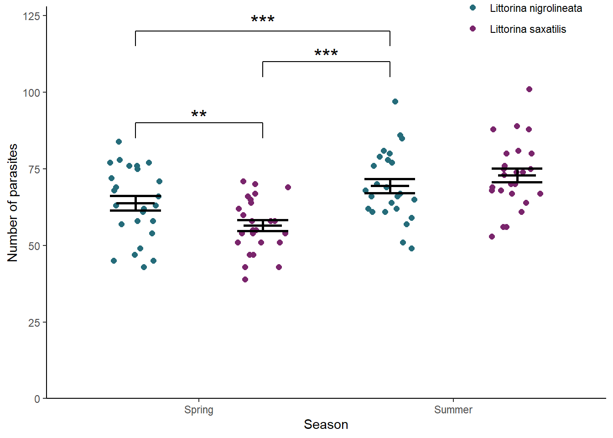

# Two-way ANOVA revisited {#two-way-anova-revisit}

In this chapter we turn our attention to designs with two categorical explanatory variables. We first use the familiar `aov()` function to carry out a two-way ANOVA and then use our understanding to help us interpret the output of `lm()`. We will also make predictions from the model and report on our results.


## Introduction to the example

A group of amateur conchologists have collected live specimens of two species of rough periwinkle (intertidal, gastropod molluscs) from sites in northern England in the Spring (1) and Summer (2). Among other variables, they take a measure of the gut parasite load.  Number of parasites is related to the number of parasites seen on a slide of gut contents and larger numbers indicate a higher parasite load. The data are in S [periwinkle.txt](data-raw/periwinkle.txt).


```r
periwinkle <- read_delim("data-raw/periwinkle.txt", delim = "\t ")
```


```r
periwinkle$species <- factor(periwinkle$species)
periwinkle$season <- factor(periwinkle$season)
```


Do a quick plot of the data. We have two explanatory variables: one can be mapped to the *x*-axis and the is mapped to a different aesthetic. We have used `fill`. 


```r
ggplot(data = periwinkle, aes(x = season, y = para, fill = species)) +
  geom_violin()
```


```r
peri_summary <- periwinkle %>% 
  group_by(season, species) %>% 
  summarise(mean = mean(para),
            sd = sd(para),
            n = length(para),
            se = sd / sqrt(n))
```
<table>
 <thead>
  <tr>
   <th style="text-align:left;"> season </th>
   <th style="text-align:left;"> species </th>
   <th style="text-align:right;"> mean </th>
   <th style="text-align:right;"> sd </th>
   <th style="text-align:right;"> n </th>
   <th style="text-align:right;"> se </th>
  </tr>
 </thead>
<tbody>
  <tr>
   <td style="text-align:left;"> Spring </td>
   <td style="text-align:left;"> Littorina nigrolineata </td>
   <td style="text-align:right;"> 63.8 </td>
   <td style="text-align:right;"> 11.92 </td>
   <td style="text-align:right;"> 25 </td>
   <td style="text-align:right;"> 2.38 </td>
  </tr>
  <tr>
   <td style="text-align:left;"> Spring </td>
   <td style="text-align:left;"> Littorina saxatilis </td>
   <td style="text-align:right;"> 56.5 </td>
   <td style="text-align:right;"> 8.88 </td>
   <td style="text-align:right;"> 25 </td>
   <td style="text-align:right;"> 1.78 </td>
  </tr>
  <tr>
   <td style="text-align:left;"> Summer </td>
   <td style="text-align:left;"> Littorina nigrolineata </td>
   <td style="text-align:right;"> 69.4 </td>
   <td style="text-align:right;"> 11.44 </td>
   <td style="text-align:right;"> 25 </td>
   <td style="text-align:right;"> 2.29 </td>
  </tr>
  <tr>
   <td style="text-align:left;"> Summer </td>
   <td style="text-align:left;"> Littorina saxatilis </td>
   <td style="text-align:right;"> 72.9 </td>
   <td style="text-align:right;"> 11.24 </td>
   <td style="text-align:right;"> 25 </td>
   <td style="text-align:right;"> 2.25 </td>
  </tr>
</tbody>
</table>

*mainly incomplete from here: code and output, little commentary*

## `aov()` output reminder


```r
mod <- aov(data = periwinkle, para ~ season * species)
```


```r
summary(mod)
#                Df Sum Sq Mean Sq F value Pr(>F)    
# season          1   3058    3058   25.58  2e-06 ***
# species         1     90      90    0.75  0.387    
# season:species  1    724     724    6.05  0.016 *  
# Residuals      96  11477     120                   
# ---
# Signif. codes:  0 '***' 0.001 '**' 0.01 '*' 0.05 '.' 0.1 ' ' 1
```


```r
res <- summary(mod)[[1]]
df_seas <- res$Df[1]
df_sp <- res$Df[2]
df_seasxsp <- res$Df[3]
df_err <- res$Df[4]
fval_seas <- res$`F value`[1]
fval_sp <- res$`F value`[2]
fval_seasxsp <- res$`F value`[3]
if (res$`Pr(>F)`[1] < 0.001) {
        pval_seas = "< 0.001"
        }
if (res$`Pr(>F)`[1] > 0.001) {
        pval_seas = paste("=", round(res$`Pr(>F)`[1], 3))
        }
if (res$`Pr(>F)`[2] < 0.001) {
        pval_sp = "< 0.001"
        }
if (res$`Pr(>F)`[2] > 0.001) {
        pval_sp = paste("=", round(res$`Pr(>F)`[2], 3))
        }
if (res$`Pr(>F)`[3] < 0.001) {
        pval_seasxsp = "< 0.001"
        }
if (res$`Pr(>F)`[3] > 0.001) {
        pval_seasxsp = paste("=", round(res$`Pr(>F)`[3], 3))
        }

```

 There was a significantly greater number of parasites in the Summer than the Spring (ANOVA: $F$ = 25.58; $d.f.$ = 1, 96; $p$ < 0.001). There was no difference between the species when averaged across the season but there was significant interaction (ANOVA: $F$ = 6.053; $d.f.$ = 1, 96; $p$ = 0.016) between season and species with higher numbers infecting *L.nigrolineata* in the Spring whilst *L.saxatilis* was more heavily parasitized in the Summer.
 
We need a post-hoc test to discover which comparisons are significant.

## Post-hoc testing for `aov`


```r
TukeyHSD(mod)
#   Tukey multiple comparisons of means
#     95% family-wise confidence level
# 
# Fit: aov(formula = para ~ season * species, data = periwinkle)
# 
# $season
#               diff  lwr  upr p adj
# Summer-Spring 11.1 6.72 15.4     0
# 
# $species
#                                            diff   lwr  upr p adj
# Littorina saxatilis-Littorina nigrolineata -1.9 -6.24 2.44 0.387
# 
# $`season:species`
#                                                               diff    lwr
# Summer:Littorina nigrolineata-Spring:Littorina nigrolineata   5.68  -2.41
# Spring:Littorina saxatilis-Spring:Littorina nigrolineata     -7.28 -15.37
# Summer:Littorina saxatilis-Spring:Littorina nigrolineata      9.16   1.07
# Spring:Littorina saxatilis-Summer:Littorina nigrolineata    -12.96 -21.05
# Summer:Littorina saxatilis-Summer:Littorina nigrolineata      3.48  -4.61
# Summer:Littorina saxatilis-Spring:Littorina saxatilis        16.44   8.35
#                                                                upr p adj
# Summer:Littorina nigrolineata-Spring:Littorina nigrolineata 13.766 0.263
# Spring:Littorina saxatilis-Spring:Littorina nigrolineata     0.806 0.093
# Summer:Littorina saxatilis-Spring:Littorina nigrolineata    17.246 0.020
# Spring:Littorina saxatilis-Summer:Littorina nigrolineata    -4.874 0.000
# Summer:Littorina saxatilis-Summer:Littorina nigrolineata    11.566 0.675
# Summer:Littorina saxatilis-Spring:Littorina saxatilis       24.526 0.000
```
Note that the output is wrapped because the names associated with each comparison, for example "Summer:Littorina nigrolineata-Spring:Littorina nigrolineata", are quite long.


*L.saxatilis* has fewer parasites in the spring than *L.nigrolineata* ($p$ = 0.02) but this rises significantly in Summer ($p$ < 0.001) while that of *L.nigrolineata* does not.


## Applying and interpreting `lm()`

```r
mod <- lm(data = periwinkle, para ~ season * species)
```


```r
mod
# 
# Call:
# lm(formula = para ~ season * species, data = periwinkle)
# 
# Coefficients:
#                             (Intercept)  
#                                   63.76  
#                            seasonSummer  
#                                    5.68  
#              speciesLittorina saxatilis  
#                                   -7.28  
# seasonSummer:speciesLittorina saxatilis  
#                                   10.76
```


The mean of L.nigrolineata in the Spring is (63.76). It is the intercept ($\beta_{0}$) because "Littorina nigrolineata" comes before "Littorina saxatilis" and "Spring" comes before "Summer" in the alphabet.

The value labelled "seasonSummer" is the difference between the intercept and the *L.nigrolineata* in the Summer. It indicates that, holding all other variables constant (in this case, species), if you change the season variable to Summer you have to add 5.68 to 63.76 to get the  mean of *L.nigrolineata* in the Summer.

The value labelled "speciesLittorina saxatilis" is also relative to the intercept. Holding all other variables constant (in this case, season), if you change the species variable to *Littorina saxatilis* you have to add -7.28 to 63.76 to get the  mean of *L.saxatilis* in the Spring.
 
Similarly, the value labelled "seasonSummer:speciesLittorina saxatilis" is relative to the intercept but the estimate, 10.76 is what you must add **additionally**. If you change the season variable to Summer and the species variable to *Littorina saxatilis* you have to add 5.68 (the effect of season), -7.28 (the effect of species) and 10.76 (the additional effect) to to 63.76 to get the  mean of *L.saxatilis* in the Summer.


## Getting predictions from the model

You must have all the combination. these are the means for two categorical variables

```r
predictions <- data.frame(species = peri_summary$species, season = peri_summary$season)
```


```r
predictions$pred <- predict(mod, newdata = predictions)
```

## Link to Chapter 2.1

Replacing the terms shown in Figure \@ref(fig:lm-annotated) with the values in this example gives us \@ref(fig:two-way-annotated).

(ref:two-way-annotated) The annotated model with the values from the myoglobin content of seal muscle example. The measured <span style=" font-weight: bold;    color: #d264c0 !important;" >response values are in pink</span>, the <span style=" font-weight: bold;    color: #c0d264 !important;" >predictions are in green</span>, and the <span style=" font-weight: bold;    color: #64c0d2 !important;" >residuals, are in blue</span>. One example of a measured value, a predicted value and the residual is shown for a Harbour Seal individual. The estimated model parameters, $\beta_{0}$ and $\beta_{1}$ are indicated. Compare to Figure \@ref(fig:lm-annotated).


## Checking assumptions


```r
plot(mod, which = 2)
plot(mod, which = 1)
shapiro.test(mod$res)
# 
# 	Shapiro-Wilk normality test
# 
# data:  mod$res
# W = 1, p-value = 0.3
```


## Post-hoc testing for `lm()`


```r
library(multcomp)
```

generic example. define linfct, mcp 
multiple comparison procedures
```


```

can be obtained by fitting the so-called cell-means model based on a new factor derived as the interaction of species and season:


```r
periwinkle$seasxspp <- interaction(periwinkle$season, periwinkle$species)
```

```r
mod2 <- lm(data = periwinkle, para ~ seasxspp)
```


```r


mod2_mc <- glht(mod2, linfct = mcp(seasxspp = "Tukey"))
summary(mod2_mc)
# 
# 	 Simultaneous Tests for General Linear Hypotheses
# 
# Multiple Comparisons of Means: Tukey Contrasts
# 
# 
# Fit: lm(formula = para ~ seasxspp, data = periwinkle)
# 
# Linear Hypotheses:
#                                                                    Estimate
# Summer.Littorina nigrolineata - Spring.Littorina nigrolineata == 0     5.68
# Spring.Littorina saxatilis - Spring.Littorina nigrolineata == 0       -7.28
# Summer.Littorina saxatilis - Spring.Littorina nigrolineata == 0        9.16
# Spring.Littorina saxatilis - Summer.Littorina nigrolineata == 0      -12.96
# Summer.Littorina saxatilis - Summer.Littorina nigrolineata == 0        3.48
# Summer.Littorina saxatilis - Spring.Littorina saxatilis == 0          16.44
#                                                                    Std. Error
# Summer.Littorina nigrolineata - Spring.Littorina nigrolineata == 0       3.09
# Spring.Littorina saxatilis - Spring.Littorina nigrolineata == 0          3.09
# Summer.Littorina saxatilis - Spring.Littorina nigrolineata == 0          3.09
# Spring.Littorina saxatilis - Summer.Littorina nigrolineata == 0          3.09
# Summer.Littorina saxatilis - Summer.Littorina nigrolineata == 0          3.09
# Summer.Littorina saxatilis - Spring.Littorina saxatilis == 0             3.09
#                                                                    t value
# Summer.Littorina nigrolineata - Spring.Littorina nigrolineata == 0    1.84
# Spring.Littorina saxatilis - Spring.Littorina nigrolineata == 0      -2.35
# Summer.Littorina saxatilis - Spring.Littorina nigrolineata == 0       2.96
# Spring.Littorina saxatilis - Summer.Littorina nigrolineata == 0      -4.19
# Summer.Littorina saxatilis - Summer.Littorina nigrolineata == 0       1.13
# Summer.Littorina saxatilis - Spring.Littorina saxatilis == 0          5.32
#                                                                    Pr(>|t|)    
# Summer.Littorina nigrolineata - Spring.Littorina nigrolineata == 0    0.263    
# Spring.Littorina saxatilis - Spring.Littorina nigrolineata == 0       0.093 .  
# Summer.Littorina saxatilis - Spring.Littorina nigrolineata == 0       0.020 *  
# Spring.Littorina saxatilis - Summer.Littorina nigrolineata == 0      <0.001 ***
# Summer.Littorina saxatilis - Summer.Littorina nigrolineata == 0       0.675    
# Summer.Littorina saxatilis - Spring.Littorina saxatilis == 0         <0.001 ***
# ---
# Signif. codes:  0 '***' 0.001 '**' 0.01 '*' 0.05 '.' 0.1 ' ' 1
# (Adjusted p values reported -- single-step method)
```


## Creating a figure


```r
#summarise the data 
ggplot() +
  geom_point(data = periwinkle, aes(x = season,
                                    y = para,
                                    colour = species),
             position = position_jitterdodge(dodge.width = 1,
                                             jitter.width = 0.4,
                                             jitter.height = 0),
             size = 2) +
  geom_errorbar(data = peri_summary, 
                aes(x = season, ymin = mean - se, ymax = mean + se, group = species),
                width = 0.4, size = 1,
                position = position_dodge(width = 1)) +
  geom_errorbar(data = peri_summary, 
                aes(x = season, ymin = mean, ymax = mean, group = species),
                width = 0.3, size = 1,
                position = position_dodge(width = 1) ) +
  scale_x_discrete(name = "Season") +
  scale_y_continuous(name = "Number of parasites",
                     expand = c(0, 0),
                     limits = c(0, 128)) +
  scale_colour_manual(values = pal4[1:2]) +
  # Spring:Littorina nigrolineata-Summer:Littorina saxatilis *
  annotate("segment", 
           x = 1.25, xend = 1.75, 
           y = 110, yend = 110,
           colour = "black") +
  annotate("segment", 
           x = 1.25, xend = 1.25,
           y = 110, yend = 105,
           colour = "black") +
  annotate("segment", 
           x = 1.75, xend = 1.75,
           y = 110, yend = 105,
           colour = "black") +
  annotate("text", 
           x = 1.5,  y = 112,
           label = "***", size = 6) +
  # Summer:Littorina nigrolineata-Spring:Littorina saxatilis: ***
  annotate("segment", 
           x = 1.25, xend = 0.75,
           y = 90, yend = 90,
           colour = "black") +
  annotate("segment", 
           x = 1.25, xend = 1.25,
           y = 90, yend = 85,
           colour = "black") +
  annotate("segment", 
           x = 0.75, xend = 0.75,
           y = 90, yend = 85,
           colour = "black") +
  annotate("text", x = 1,  y = 92,
           label = "**", size = 6) +
# Summer:Littorina saxatilis-Spring:Littorina saxatilis: ***
  annotate("segment",
           x = 0.75, xend = 1.75,
           y = 120, yend = 120,
           colour = "black") +
  annotate("segment",
           x = 0.75, xend = 0.75,
           y = 120, yend = 115,
           colour = "black") +
  annotate("segment",
           x = 1.75, xend = 1.75,
           y = 120, yend = 115,
           colour = "black") +
  annotate("text", x = 1.25,  y = 123,
           label = "***", size = 6) +
  theme_classic() +
  theme(legend.title = element_blank(),
        legend.position = c(0.85, 0.98)) 
```




## Reporting the results
*to add: principle, sig, magnitude and diection of effects, test result, figure*

See figure \@ref(fig:fig-two-anova-report).

(ref:fig-two-anova-report) periwinkles blah blah


