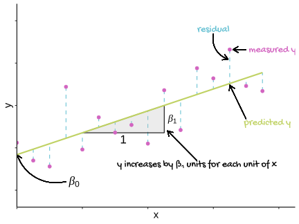

# What are linear models {#what-are-linear-models}


## What is a linear model?
A linear model describes a continuous response variable as a function of one or more explanatory variables. When you have a single explanatory variable, that model is:


\begin{equation}
E(y_{i})=\beta_{0}+\beta_{1}X1_{i}
(\#eq:lm1)
\end{equation}

Where:  

 - $y$ is the response variable and $X1$ is the explanatory variable.  
 - $i$ is the index so $X1_{i}$ is the $i$th value of $X1$
 - $E(y_{i})$ is the expected value of $y$ for the $i$th value of $X1$. 
 - $\beta_{0}$ and $\beta_{1}$ are the coefficients in the model. In a single linear regression, $\beta_{0}$ is often called the intercept and $\beta_{1}$ the slope.  
 

The equation \@ref(eq:lm1) allows the response, $y$ to be predicted for a given value of the explanatory variable. 

The process of estimating the model coefficients from your data (set of chosen $X1$ with their measured $y$ values) is known as *fitting a linear model*. The coefficients are also known as parameters.

The measured response values in your data set will differ from the predicted values randomly and these random differences are known as *residuals* or errors. 

See Figure \@ref(fig:lm-annotated) for a graphical representation of linear modelling terms introduced so far. We will reference this figure in later chapters.

(ref:lm-annotated) A linear model annotated with the terms used in linear modelling. The measured <span style=" font-weight: bold;    color: #d264c0 !important;" >response values are in pink</span>, the <span style=" font-weight: bold;    color: #c0d264 !important;" >predictions are in green</span>, and the differences between these, known as the <span style=" font-weight: bold;    color: #64c0d2 !important;" >residuals, are in blue</span>. The estimated model parameters, $\beta_{0}$ (the intercept) and $\beta_{1}$ (the slope) are indicated.

<div class="figure" style="text-align: left">

<p class="caption">(\#fig:lm-annotated)(ref:lm-annotated)</p>
</div>


A key assumption of the model is that the residuals are normally distributed for any value of $x$ and those distributions have equal variance. This typically occurs when the response variable is normally distributed.


When you have more than one explanatory variable these are given as $X2$, $X3$ and so on up to the $p$th explanatory variable. Each explanatory variable has its own $\beta$ coefficient. 

The general form of the model is:
\begin{equation}
E(y_{i})=\beta_{0}+\beta_{1}X1_{i}+\beta_{2}X2_{i}+...+\beta_{p}Xp_{i}
(\#eq:lm2)
\end{equation}

The model has only one intercept which is the value of the response when all the explanatory variables are zero.

## Linear models in R

*T*-tests and ANOVA, like regression, can be carried out with the `lm()` function in R. It uses the same method for specifying the model. When you have one explanatory variable the command is: 

<code>lm(data = *dataframe*, *response* ~ *explanatory*)</code>

The `response ~ explanatory` part is known as the model **formula**.

When you have two explanatory variable we add the second explanatory variable to the formula using a `+` or a `*`. The command is: 

<code>lm(data = *dataframe*, *response* ~ *explanatory1* + *explanatory2*)</code>

or

<code>lm(data = *dataframe*, *response* ~ *explanatory1* * *explanatory2*)</code>

A model with `explanatory1 + explanatory2` considers the effects of the two variables independently. A model with `explanatory1 + explanatory2` considers the effects of the two variables *and* any interaction between them. 

We usually assign the output of `lm()` commands to an object and view it with `summary()`. The typical workflow would be:

<code>
mod <- lm(data = *dataframe*, *response* ~ *explanatory*)  
summary(mod)
</code>

There are two sorts of statistical tests in the output of `summary(mod)`: tests of whether each coefficient is significantly different from zero; a test of whether the model as a whole explains a significant amount of the variation in the response.

:::key
`lm()` can be used to perform tests using the General Linear Model including *t*-tests, ANOVA and regression for response variables which are normally distributed.
:::

Elements of the `lm()` object include the estimated coefficients, the predicted values and the residuals can be accessed with `mod$coeffients`, `mod$fitted.values` and `mod$residuals` respectively.


`mod$fitted.values` gives the predicted values for the explanatory variable values actually used in the experiment, *i.e.*, there is a prediction for each row of data. To get predictions for a different set of values make a dataframe of the different set of values and use the `predict()` function.. The typical workflow would be:

<code>
predict_for <- data.frame(*explanatory* = *values*)  
predict_for$pred <- predict(mod, newdata = predict_for)
</code>

The assumptions of the model are checked using the `plot()` function which produces diagnostic plots to explore the distribution of the residuals. They are not proof of the assumptions being met but allow us to quickly determine if the assumptions are plausible, and if not, how the assumptions are violated and what data points contribute to the violation.


The two plots which are most useful are the "Q-Q" plot (plot 2) and the "Residuals vs Fitted" plot (plot 1). These are given as values to the `which` argument of `plot()`.


The Q-Q plot is a scatterplot of the residuals (standardised to a mean of zero and a standard deviation of 1) against what is expected if the residuals are normally distributed. 

```r
plot(mod, which = 2)
```


The points should fall roughly on the line if the residuals are normally distributed. 

The following are two examples in which the residuals are not normally distributed.


The Residuals vs Fitted plot shows if residuals have homogeneous variance or have non-linear patterns. Non-linear relationship between explanatory variables and the response will usually show in this plot if the model does not capture the non-linear relationship. For the assumptions to be met, the residuals should be equally spread around a horizontal line:

```r
plot(mod, which = 1)
```


The following are two examples in which the residuals do not have homogeneous variance and display non-linear patterns.

