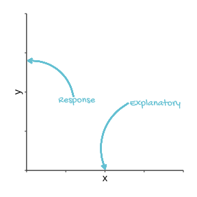
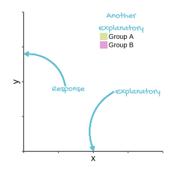
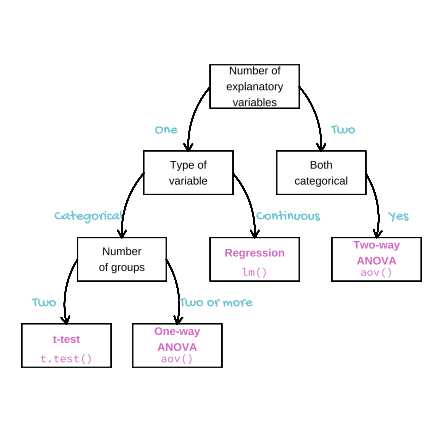

--- 
title: "singlm: A simple introduction to GLM for analysing Poisson and Binomial responses in R"
author: "Emma Rand"
date: "`r Sys.Date()`"
site: bookdown::bookdown_site
documentclass: book
bibliography: [refs/book.bib, refs/packages.bib]
biblio-style: apalike
link-citations: yes
description: "The output format for this example is bookdown::gitbook."
---

# Introduction {-#intro}

```{r include=FALSE}
# automatically create a bib database for R packages
knitr::write_bib(c(.packages(),
                   'bookdown',
                   'knitr',
                   'rmarkdown',
                   'tidyverse'),
                 'packages.bib')
```


```{r index-pkg, include=FALSE}
library(tidyverse)

```

## Who is this book for?

The aim of this book is to give people who have a little experience of doing data analysis in R a light introduction to Generalised Linear Models.
It might be for you have done an introductory class in data analysis which covered classical univariate tests such as single linear regression, *t*-tests, one-way ANOVA and two-way ANOVA. It assumes you have some familiarity with R and RStudio and could import data, apply `t.test()` and `aov()` functions appropriately, interpret the results and create figures using `ggplot()`. It does not assume you are so fluent you could do these things with looking anything up, just that you would understand what you were doing and how to interpret the results.

Secondary aim of this book is to introduce the terminology of statistical modelling to make your transition to more advanced texts easier.

scope of the book, what isn't covered

Maths - intended to help you understand. ignore if it confuses you.

## formatting options on the menu


## Conventions used in the book
With in the text
Packages are indicated in bold code font like this: **`ggplot2`**
Functions are indicated in code font with brackets after their name like this: `ggplot()`

:::key
The key point of a previous few paragraphs is in boxes like these
:::

:::fyi
Extra information and tips are in boxes like these
:::

objects in R are indicated in code font like this: `mod` `stag`
we'll be using `tidyverse` [@tidyverse2019] packages.

:::fyi
You can learn the tidyverse
:::


##  Overview of the chapter contents
**Chapter 1**
In the first chapter we work through examples carried out in both `lm()` and their more more beginner friendly alternatives to gain a good understanding of the anatomy of `lm()` output.

**Chapter 2**
...

**Chapter 3**
...


## Introductory class revision
In experimental design and execution we manipulate or choose one or more variables and record how changing their values effect another variable. The variables we manipulate or choose are called explanatory or predictor variables and the other is called the response. These are also known as independent and dependent variables respectively.

:::key
Predictor, Explanatory, *x* and Independent: all terms used to describe the variables we choose.  
Predicted, Response, *y* and Dependent: all terms used to describe the variable we measure.
:::

When we plot data, the response variable goes on the *y*-axis and the explanatory variable goes on the *x*-axis

```{r echo=FALSE}

```

If we have two explanatory variables we might indicate the different values of one of them with colour.


```{r echo=FALSE}

```

In choosing between regression, *t*-tests, one-way ANOVA and two-way ANOVA we consider how many explanatory variables we have and whether they are continuous or categorical. If we have one explanatory variable and it is continuous, we can apply a regression; if it is a categorical variable with two groups (or levels) we have the choice of a *t*-test or a one way ANOVA but when there are more than two groups we use a one-way ANOVA. A two-way ANOVA is used when there are two categorical explanatory variables.


```{r echo=FALSE, out.width="100%"}

```

These apparently different tests are, in fact, the same test. They have the same underlying mathematics and, or to put it another way, the follow the same model. That model is usually known as the **General Linear Model**. 

Running a test = building or fitting a model. tests of how well our data fit the model, tests for the model parameters against a null hypothesis

In R *t*-tests and ANOVA, like regression, can be carried out with the `lm()` function. The output differs but the results themselves are identical. The model makes a prediction for the response variable for a given value of the explanatory variable. The difference between the predicted value and the observed value is the residual.

:::key
`lm()` can be used to perform tests using the General Linear Model including *t*-tests, ANOVA and regression for response variables which are normally distributed.
:::

The General Linear Model requires that the response variable has residuals that follow the normal distribution with variance which is homogeneous for the values of the explanatory variables. This commonly occurs when the response variable has a normal distribution. The **General_ised_** Linear Model* extends the General Linear Model by including response variables that do not follow the normal distribution. 

This book introduces the the Generalised Linear Model for two types of response:

1. Binomially distributed: response variables are binary, that is, they can take one of only two values, such as "yes" or "no", "alive" or "dead", "present" or "absent"  
2. Poisson distributed: response variables that indicate the number of things and thus take discrete values from 0 up.

In R, these are analysed with the `glm()` function.

:::key
`glm()` can be used to perform tests using the Generalised Linear Model for response variables which are counts or binary.
:::

## Approach of this book
One of the reasons functions such as `t.test()` and `aov()` are taught rather than `lm()` is because the output is usually easier for those new to data analysis to understand and interpret. However, the output of `lm()` is more typical of statistical modelling functions in general and this makes it  difficult for people to take small steps forward in their the statistical repertoire. The approach taken in this book is to exploit preexisting knowledge of *t*-tests and ANOVA using `t.test()` and `aov()` to understand the output of `lm()`. This will allow us to more easily understand the output of `glm()` 

