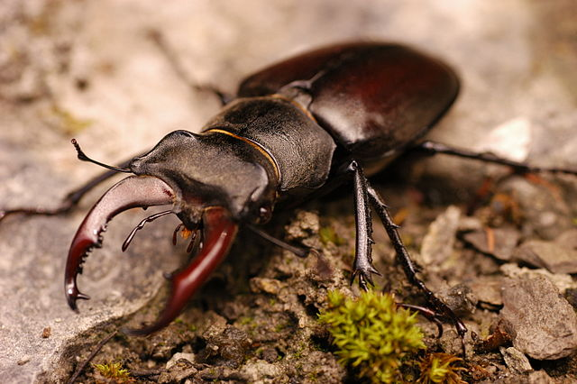

# Single linear regression

You have probably carried out a single linear regression in your introductory data analysis class. It is covered here as revision.

## Introduction to the example
The concentration of Juvenile growth hormone in male stag beetles (*Lucanus cervus*) is known to influence mandible growth. See Figure \@ref(fig:lucanus-fig)

(ref:lucanus-fig) Male stag beetles *Lucanus cervus*, have large mandibles that resemble the antlers of a stag and give them their common and scientific name (*Cervus* is a genus of deer). By Simon A. Eugster - Own work, CC BY 3.0, https://commons.wikimedia.org/w/index.php?curid=7790887

```{r lucanus-fig, echo = FALSE, fig.cap='(ref:lucanus-fig)'}

```

Groups of ten stag beetles were treated with different concentrations of Juvenile growth hormone (pg$\mu$l^-1^) and their average mandible size (mm) determined. The data are in [stag.txt](data-raw/stag.txt). Juvenile hormone is has been set by the experimenter and we would expect mandible size to be normally distributed. 

We will import the data with the `read_table2()` function from the **`readr`** package and plot it with `ggplot()` from the **`ggplot2`** package. Both packages are part of the tidyverse.

Import the data:
```{r}
stag <- read_table2("data-raw/stag.txt")
glimpse(stag)
```

:::key
There are 2 variables: `jh`, the concentration of Juvenile growth hormone and `mand`, the average mandible size (mm) of 10 stag beetles
:::

Visualising our data before any further analysis is sensible. In this case, it will help us determine if any relationship between the two variables is linear.
A simple scatter plot is appropriate.

```{r}
ggplot(data = stag, aes(x = jh, y = mand)) +
        geom_point()
```
The relationship between the two variables looks roughly linear. So far, common sense suggests the assumptions of regression are met.

## Applying and interpreting `lm()`

The `lm()` function is used to build the regression model:

```{r}
mod <- lm(data = stag, mand ~ jh)
```


This can be read as: fit a linear of model of mandible size explained by the concentration of Juvenile growth hormone.

Printing `mod` to the console will reveal the estimated model parameters (coefficients) but little else:

```{r}
mod
```

```{r echo=FALSE}
res <- summary(mod)
b0 <- res$coefficients["(Intercept)", "Estimate"]
b1 <- res$coefficients["jh", "Estimate"]
b0se <- res$coefficients["(Intercept)", "Std. Error"]
b1se <- res$coefficients["jh", "Std. Error"]
if (res$coefficients["(Intercept)", "Pr(>|t|)"] < 0.001) {
        b0p = "< 0.001"
        }
if (res$coefficients["(Intercept)", "Pr(>|t|)"] > 0.001) {
        b0p = paste("=", round(res$coefficients["(Intercept)", "Pr(>|t|)"], 3))
        }
if (res$coefficients["jh", "Pr(>|t|)"] < 0.001) {
        b1p = "< 0.001"
        }
if (res$coefficients["jh", "Pr(>|t|)"] > 0.001) {
        b1p = paste("=", round(res$coefficients["jh", "Pr(>|t|)"], 3))
        }
rsq <- res$r.squared
if (anova(mod)$`Pr(>F)`[1] < 0.001) {
        modelp = "< 0.001"
        }
if (anova(mod)$`Pr(>F)`[1] > 0.001) {
        modelp = paste("=", round(anova(mod)$`Pr(>F)`[1], 3))
        }
```

$\beta_{0}$ is labelled `(Intercept)` and $\beta_{1}$ is labelled `jh`. Thus, the equation of the line is:

<center> $mand$ = `r b0` + `r b1`$jh$ </center>

More information including statistical tests of the model and its parameters is obtained by using `summary()`:
```{r}
summary(mod)

```

The `Coefficients` table gives the estimated $\beta_{0}$ and $\beta_{1}$ again but along with their standard errors and tests of whether the estimates differ from zero. The estimated value for the intercept is `r b0` $\pm$ `r b0se` and this differs significantly from zero ($p$ `r b0p`). The estimated value for the slope is `r b1` $\pm$ `r b1se`, also differs significantly from zero ($p$ `r b1p`). 

The three lines at the bottom of the output give information about the fit of the model to the data. The `Multiple R-squared` gives the proportion of the variance in the response which is explained by the model. In our case, `r rsq` of the variance in mandible length is explained by the model and this is a significant proportion of that variance ($p$ `r modelp`). 


The *p*-value for the model and the *p*-value for the slope are the same in a single linear regression because, except for the intercept, there is only one parameter (the slope) in the model. Linear models in the form of a two-sample *t*-test also estimate just one parameter and its *p*-value will also equal the model *p*-value. This is **not** the case for other linear models.

## Link to Chapter 2.1

The estimated coefficients tell us mandible size is predicted to be `r b0` when Juvenile growth hormone is zero and increases by 0.006 mm for each pg$\mu$l^-1^ of Juvenile growth hormone. 

At a Juvenile growth hormone of 1 pg$\mu$l^-1^  the mandible is predicted to be `r b0` + `r b1` = `r b0 + b1` mm. 

At 2 pg$\mu$l^-1^ the predicted mandible size is `r b0` + `r b1` + `r b1` = `r b0 + b1 + b1` mm. 


In general mandible size is: $\beta_{0}$ + $x\times\beta_{0}$ mm at $x$ pg$\mu$l^-1^. See Figure \@ref(fig:stag-annotated) for a version of Figure \@ref(fig:lm-annotated) annotated with values from this example.

(ref:stag-annotated) The model annotated with values from the stag beetle example. The measured `r kableExtra::text_spec("response values are in pink", color = pal3[2], bold = TRUE)`, the `r kableExtra::text_spec("predictions are in green", color = pal3[3], bold = TRUE)`, and the `r kableExtra::text_spec("residuals, are in blue", color = pal3[1], bold = TRUE)`. One example of a measured value, a predicted value and the residual is shown for a  Juvenile hormone of 130 pg$\mu$l^-1^. The estimated model parameters, $\beta_{0}$ and $\beta_{1}$ are indicated. Compare to Figure \@ref(fig:lm-annotated).

```{r stag-annotated, echo = FALSE, fig.cap="(ref:stag-annotated)"} 
knitr::include_graphics("images/fig_5.svg")
```


## Getting predictions from the model

The `predict()` returns the predicted values of the response. To add a column of predicted values to the `stag` dataframe we use: 

```{r }
stag$pred <- predict(mod)
glimpse(stag)
```
This gives predictions for the actual Juvenile growth hormone concentration values used. If you want predictions for other values, you need to create a data frame of the Juvenile growth hormone values from which you want to predict. 
The following creates a dataframe with one column of Juvenile growth hormone values from 0 to 150 in steps of 5:
```{r}
predict_for <- data.frame(jh = seq(0, 150, 5))
glimpse(predict_for)
```

Note that the column is named `jh` - the same as in the dataset and the model. Its variable type must also match.

:::key
To predict responses for a new set of explanatory variable values, the name and type of explanatory variables in the new set must match those in the model.
:::

To get predicted mandible sizes for the Juvenile growth hormone values we use:
```{r}
predict_for$pred <- predict(mod, newdata = predict_for)
glimpse(predict_for)

```


## Checking assumptions

The two assumptions of the model can be checked using diagnostic plots. The Q-Q plot is obtained with:
```{r}
plot(mod, which = 2)
```

This sample is relatively small so we should expect more wiggliness than we saw in 2.2 but this looks OK.

Let's look at the Residuals vs Fitted plot:

```{r}
plot(mod, which = 1)

```

Again the red line wiggles a little but there is no particular pattern and it appears that the variance is homogeneous along mandible size.

## Creating a figure

A suitable figure includes the data themselves and the model fitted:
```{r fig-reg}
ggplot(data = stag, aes(x = jh, y = mand)) +
        geom_point() +
        scale_x_continuous(expand = c(0.01, 0),
                           limits = c(0, 160),
                           name = expression(paste("Juvenile growth hormone (pg",
                                                   mu,
                                                   l^-1,
                                                   ")"))) +
        scale_y_continuous(expand = c(0, 0),
                           limits = c(0, 2),
                           name = "Mandible length (mm)") +
        geom_smooth(method = lm, se = FALSE, colour = "black") +
        theme_classic()
```


## Reporting the results

There was a significant positive relationship between the concentration of Juvenile growth hormone and mandible length ($\beta_{1}\pm s.e.$: `r b1` $\pm$ `r b1se`; $p$ `r b1p`). See figure \@ref(fig:fig-reg-report).

(ref:fig-reg-report) Relationship between the concentration of Juvenile growth hormone and mandible length. 

```{r fig-reg-report, ref.label = 'fig-reg', echo = FALSE, fig.height=4, fig.width=4, fig.cap="(ref:fig-reg-report)", out.width = "60%"} 
```


