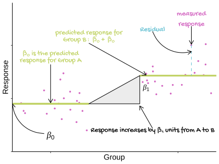
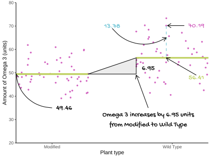

# (PART) USING `lm()` FOR FAMILIAR TESTS {-}

# *t*-tests revisited {#t-tests-revisit}

In this chapter we look at an example with one categorical explanatory variable which has two groups (or levels). We first use the familiar `t.test()` then use its output to help us understand the output of `lm()`. We will also make predictions from the model and report on our results.

## Introduction to the example

Some plant biotechnologists developed a genetically modified line of *Cannabis sativa* to increase its omega 3 fatty acids content. They grew 50 wild type and fifty modified plants to maturity, collect the seeds and measure the amount of omega 3 fatty acids (in arbitrary units). The data are in [csativa.txt](data-raw/csativa.txt). They want to know if the wild type and modified plants differ significantly in their omega 3 fatty acid content. 


We again use the `read_table2()` function to import the data and visualise it with `ggplot()`


```{r}
csativa  <-  read_table2("data-raw/csativa.txt")
glimpse(csativa)
```

:::key
There are 2 variables: `plant` is the explanatory variable and is categorical with 2 levels; and `omega`, a continuous variable, is the response.
:::

A quick plot of the data:
```{r}
ggplot(data = csativa, aes(x = plant, y = omega)) +
  geom_violin()

```

:::fyi
Violin plots are a useful way to show the distribution of data in each group but not the only way. One alternative is `geom_boxplot()`.
:::


The modified plant have a lower mean omega 3 content than the wild type plants. The modification appears not to be successful. In fact, it may have significantly lowered the omega 3 content!

Statistical comparison of the two means can be done with either the `t.test()` or `lm()` functions; these are **exactly** equivalent but present the results differently. We will use our understanding of applying and interpreting `t.test()` to develop our understanding of `lm()` output

## `t.test()` output reminder

We can apply a two-sample *t*-test with:

```{r}
t.test(data = csativa, omega ~ plant, var.equal = TRUE)
```
```{r echo=FALSE}
res <- t.test(data = csativa, omega ~ plant, var.equal = TRUE)
modifm <- res$estimate["mean in group modif"]
modifw <- res$estimate["mean in group wild"]
if (res$p.value < 0.001) {pval = "< 0.001"}
if (res$p.value > 0.001) {pval = paste("=", round(res$p.value), 3)}
tval <- res$statistic
df <- res$parameter
```


The two groups means are given in the section labelled `sample estimates` and the test of whether they differ significantly is given in the fourth line (beginning `t = -5, df = ...`). We conclude the mean omega 3 content of the modified plants (`r modifm` units) is significantly lower than that of the wild type plants ($t$ = `r abs(tval)`, $d.f.$ = `r df`, $p$ `r pval`).

The line under `95 percent confidence interval`gives the confidence limits on the difference between the two means.

The sign on the $t$ value and the confidence limits, and the order in which the sample estimates are given is determined by R's alphabetical ordering of the groups. As "modif" comes before "wild" in the alphabet, "modif" is the first group and the test is the modified plant mean minus the wild type mean. This has no impact on our conclusions. If the wild type plants been labelled "control" so that "modif" would be the second group, our output would look like this:

```{r}
# 	Two Sample t-test
# 
# data:  omega by plant
# t = 5.0289, df = 98, p-value = 2.231e-06
# alternative hypothesis: true difference in means is not equal to 0
# 95 percent confidence interval:
#  4.205372 9.687828
# sample estimates:
# mean in group control  mean in group modif
#             56.4118             49.4652
# 
```

## *t*-tests as linear models

The equation for a *t*-test is just as it was for equation \@ref(eq:lm1):
\begin{equation}
E(y_{i})=\beta_{0}+\beta_{1}x_{i}
(\#eq:t-test)
\end{equation}

Remember, in a single linear regression $\beta_{0}$, the intercept, is the value of the response when the numerical explanatory variable is zero. What does this mean when the explanatory variable is categorical?

The equivalent here is that the intercept is the value of the response when the categorical explanatory is at its "lowest" level. The order of the groups is determined alphabetically so the "lowest" level is the group which comes first alphabetically.

$x_{i}$ is an indicator variable that takes the value of 0 or 1 and indicates whether the $i$th value was from one group or not. Such variables are known as **dummy explanatory variables**. They are dummy in the sense that they are numerical substitutes for the categorical variable whose 'real' values are the names of the categories.

If it has a value of 0 for a data point it means that $\beta_{1}$ will not impact the response which will take the value of $\beta_{0}$.

If it has a value 1 then $\beta_{1}$ will change the response which will take the value of $\beta_{0}$ + $\beta_{1}$

$\beta_{1}$ is thus the *difference* between the group means,

See Figure \@ref(fig:t-annotated) for a graphical representation of the terms in a linear model when the explanatory variable is categorical with two groups. 

(ref:t-annotated) An linear model when the explanatory variable is categorical with two groups annotated with the terms used in linear modelling. The measured `r kableExtra::text_spec("response values are in pink", color = pal3[2], bold = TRUE)`, the `r kableExtra::text_spec("predictions are in green", color = pal3[3], bold = TRUE)`, and the differences between these, known as the `r kableExtra::text_spec("residuals, are in blue", color = pal3[1], bold = TRUE)`. The estimated model parameters, $\beta_{0}$ (the intercept) and $\beta_{1}$ (the slope) are indicated. Compare to Figure \@ref(fig:lm-annotated).

```{r t-annotated, echo = FALSE, fig.cap="(ref:t-annotated)"} 

```


## Applying and interpreting `lm()`

The `lm()` function is applied to this example as follows:
```{r}
mod <- lm(data = csativa, omega ~ plant)
```

This can be read as: fit a linear of model of omega content explained by plant type. Notice that the model formula is the same in both functions.

Printing `mod` to the console gives us these estimated model parameters (coefficients):

```{r}
mod
```

```{r echo=FALSE}
res <- summary(mod)
b0 <- res$coefficients["(Intercept)", "Estimate"]
b1 <- res$coefficients["plantwild", "Estimate"]
b0se <- res$coefficients["(Intercept)", "Std. Error"]
b1se <- res$coefficients["plantwild", "Std. Error"]
tval <- res$coefficients["plantwild", "t value"]
df <- res$df[2]

if (res$coefficients["(Intercept)", "Pr(>|t|)"] < 0.001) {
        b0p = "< 0.001"
        }
if (res$coefficients["(Intercept)", "Pr(>|t|)"] > 0.001) {
        b0p = paste("=", round(res$coefficients["(Intercept)", "Pr(>|t|)"], 3))
        }
if (res$coefficients["plantwild", "Pr(>|t|)"] < 0.001) {
        b1p = "< 0.001"
        }
if (res$coefficients["plantwild", "Pr(>|t|)"] > 0.001) {
        b1p = paste("=", round(res$coefficients["plantwild", "Pr(>|t|)"], 3))
        }
rsq <- res$r.squared
if (anova(mod)$`Pr(>F)`[1] < 0.001) {
        modelp = "< 0.001"
        }
if (anova(mod)$`Pr(>F)`[1] > 0.001) {
        modelp = paste("=", round(anova(mod)$`Pr(>F)`[1], 3))
        }

```

The first group of `plant` is `modif` so $\beta_{0}$ is the mean of the modified plants. $\beta_{1}$ is the coefficient labelled `plantwild`. It means when the  variable `plant` takes the value `wild`, $\beta_{1}$ must be added to $\beta_{0}$

In R, the coefficients are consistently named with the variable name followed, without spaces, by the value.

Thus, the mean omega 3 in the modified plants is `r b0` units and that in the wild type plants is `r b0` + `r b1` =` r b0+b1` units.

More information including statistical tests of the model and its parameters is obtained by using `summary()`:

```{r}
summary(mod)
```
The `Coefficients` table gives the estimated $\beta_{0}$ and $\beta_{1}$ again but along with their standard errors and tests of whether the estimates differ from zero. The estimated mean of the modified plants is `r b0` $\pm$ `r b0se` and this differs significantly from zero ($p$ `r b0p`). The estimated difference between the modified and wild type plants is `r b1` $\pm$ `r b1se` and also differs significantly from zero ($p$ `r b1p`). The fact that this value is positive tells us that the wild type plants have a higher mean.

The proportion of the variance in the omega which is explained by the model is `r rsq` and this is a significant proportion of that variance ($p$ `r modelp`). 


As was true for single linear regression, the *p*-value for the model and the *p*-value for the difference between the means are the same because, except for the intercept, there is only one parameter in the model. 


Replacing the terms shown in Figure \@ref(fig:t-annotated) with the values in this example gives us \@ref(fig:csat-annotated).

(ref:csat-annotated) The annotated model with the values from the Omega 3 content of *Cannabis sativa* example. The measured `r kableExtra::text_spec("response values are in pink", color = pal3[2], bold = TRUE)`, the `r kableExtra::text_spec("predictions are in green", color = pal3[3], bold = TRUE)`, and the `r kableExtra::text_spec("residuals, are in blue", color = pal3[1], bold = TRUE)`. One example of a measured value, a predicted value and the residual is shown for a wild type individual. The estimated model parameters, $\beta_{0}$ and $\beta_{1}$ are indicated. Compare to Figure \@ref(fig:t-annotated).

```{r csat-annotated, echo = FALSE, fig.cap="(ref:csat-annotated)"} 

```


## Getting predictions from the model

We already have the predictions for the possible values of the explanatory variable  - there are only two!

However the code for for uses predict is included here because it will make it easier to understand more complex examples where you have more than one explanatory variable some of which are categorical and some of which are continuous.

To create a dataframe with one column of Plant values:
```{r}
predict_for <- data.frame(plant = c("modif", "wild"))
```

The to get the predicted omega content for the two plant types:

```{r}
predict_for$pred <- predict(mod, newdata = predict_for)
glimpse(predict_for)
```


## Checking assumptions

The two assumptions of the model can be checked using diagnostic plots. The Q-Q plot is obtained with:
```{r}
plot(mod, which = 2)
```

The residual seem to be normally distributed.

Let's look at the Residuals vs Fitted plot:

```{r}
plot(mod, which = 1)

```

We get these two columns of points because the explanatory variable, `plant`, is categorical so the fitted - or predicted - values are just two means. In my view, the variance looks higher in the group with the higher mean (on the right).

## Creating a figure


```{r}
csativa_summary <- csativa %>%
  group_by(plant) %>%
  summarise(mean = mean(omega),
            std = sd(omega),
            n = length(omega),
            se = std/sqrt(n))
```


```{r fig-ttest}
#summarise the data 

ggplot() +
  geom_jitter(data = csativa, 
              aes(x = plant, y = omega), 
              width = 0.25, colour = "grey") +
  geom_errorbar(data = csativa_summary,
                aes(x = plant,
                    ymin = mean,
                    ymax = mean),
                width = .3) +
  geom_errorbar(data = csativa_summary,
                aes(x = plant,
                    ymin = mean - se,
                    ymax = mean + se),
                width = .5) +
  geom_segment(aes(x = 1, y = 75, xend = 2, yend = 75),
               size = 1) +
  geom_segment(aes(x = 1, y = 75, xend = 1, yend = 73),
               size = 1) +
  geom_segment(aes(x = 2, y = 75, xend = 2, yend = 73),
               size = 1) +
  annotate("text", x = 1.5, y = 77,  label = "***", size = 6) +
  scale_x_discrete(labels = c("Modified", "Wild Type"),
                   name = "Plant type") +
  scale_y_continuous(name = "Amount of Omega 3 (units)",
                     expand = c(0, 0),
                     limits = c(0, 90)) +
  theme_classic()
```

## Reporting the results

The genetic modification was unsuccessful with wild type plants ($\bar{x} \pm s.e.$: `r csativa_summary[2,"mean"]` $\pm$ `r csativa_summary[2,"se"]` units) have significantly higher omega 3 than modified plants(`r csativa_summary[1,"mean"]` $\pm$ `r csativa_summary[1,"se"]` units) ($t$ = `r tval`; $d.f.$ = `r df`; $p$ `r b1p`). See figure \@ref(fig:fig-ttest-report).

(ref:ch1-ttest-report) Omega 3 content of wild type and a genetically modified *Cannabis sativa* 

```{r fig-ttest-report, ref.label = 'fig-ttest', echo = FALSE, fig.height=4, fig.width=4, fig.cap="(ref:fig-reg-report)", fig.align="left", out.width = "60%"} 
```


